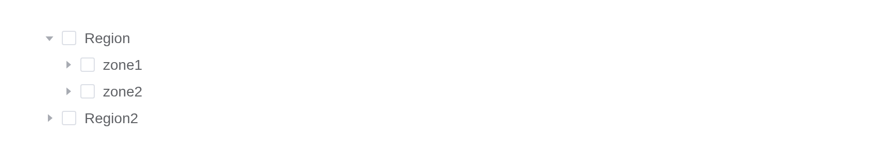
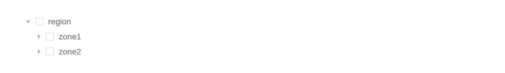
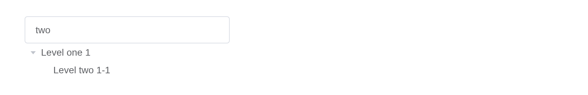

# Tree

Display a set of data with hierarchies.

## Basic usage

Basic tree structure.

Nodes are `list(id =, label =, children =)`;
[`df_to_tree_data()`](https://kaipingyang.github.io/shiny.element/reference/df_to_tree_data.md)
builds them from a data frame. `input$<id>` is the key of the node last
clicked, `input$<id>_checked` the keys checked.

``` r

levels <- list(
  list(
    id = 1,
    label = "Level one 1",
    children = list(
      list(
        id = 4,
        label = "Level two 1-1",
        children = list(list(id = 9, label = "Level three 1-1-1"))
      )
    )
  ),
  list(
    id = 2,
    label = "Level one 2",
    children = list(
      list(id = 5, label = "Level two 2-1"),
      list(id = 6, label = "Level two 2-2")
    )
  ),
  list(
    id = 3,
    label = "Level one 3",
    children = list(
      list(id = 7, label = "Level two 3-1"),
      list(id = 8, label = "Level two 3-2")
    )
  )
)
el_tree("basic", data = levels, node_key = "id")
```

## Selectable

Used for node selection.

This example also shows how to load node data asynchronously.

With `lazy = TRUE` each node’s children come from the server, asked for
through `input$<id>_load` and answered with
[`el_load_children()`](https://kaipingyang.github.io/shiny.element/reference/el_load_children.md).

``` r

ui <- el_page(el_tree(
  "zones",
  lazy = TRUE,
  node_key = "id",
  show_checkbox = TRUE
))

server <- function(input, output, session) {
  observeEvent(input$zones_load, {
    q <- input$zones_load
    kids <- if (q$level == 0) {
      list(
        list(id = "region1", label = "Region"),
        list(id = "region2", label = "Region2")
      )
    } else if (q$level > 3) {
      list()
    } else {
      lapply(1:2, function(i) {
        list(id = paste0(q$key, "-", i), label = paste0("zone", i))
      })
    }
    el_load_children(id = "zones", request = q, children = kids)
  })
}

shinyApp(ui, server)
```



> **Warning**
>
> When using show-checkbox, since `check-on-click-leaf` is true by
> default, last tree children’s can be checked by clicking their nodes.

## Custom leaf node in lazy mode

A node’s data is not fetched until it is clicked, so the Tree cannot
predict whether a node is a leaf node. That’s why a drop-down button is
added to each node, and if it is a leaf node, the drop-down button will
disappear when clicked. That being said, you can also tell the Tree in
advance whether the node is a leaf node, avoiding the render of the
drop-down button before a leaf node.

`props = list(isLeaf =)` names the field that says a node has no
children, so it draws no expand arrow.

``` r

ui <- el_page(el_tree(
  "zones",
  lazy = TRUE,
  node_key = "id",
  show_checkbox = TRUE,
  props = list(isLeaf = "leaf")
))

server <- function(input, output, session) {
  observeEvent(input$zones_load, {
    q <- input$zones_load
    kids <- if (q$level == 0) {
      list(list(id = "region", label = "region"))
    } else {
      lapply(1:2, function(i) {
        list(
          id = paste0(q$key, i),
          label = paste0("zone", i),
          leaf = q$level >= 2
        )
      })
    }
    el_load_children(id = "zones", request = q, children = kids)
  })
}

shinyApp(ui, server)
```



## Lazy loading multiple times

When lazily loading node data remotely, lazy loading may sometimes fail.
In this case, you can call reject to keep the node status as is and
allow remote loading to continue.

A load can fail: `el_load_children(reject = TRUE)` is Element Plus’s
`reject()`, and the node can be expanded again to retry. Here the server
refuses the first three tries.

``` r

ui <- el_page(el_tree("regions", lazy = TRUE, props = list(isLeaf = "leaf")))

server <- function(input, output, session) {
  tries <- 0
  observeEvent(input$regions_load, {
    q <- input$regions_load
    if (q$level == 0) {
      el_load_children(
        id = "regions",
        request = q,
        children = list(list(label = "region"))
      )
      return()
    }
    tries <<- tries + 1
    later::later(
      function() {
        if (tries > 3) {
          el_load_children(
            id = "regions",
            request = q,
            children = lapply(1:3, function(i) {
              list(label = paste0("zone", i), leaf = TRUE)
            }),
            session = session
          )
        } else {
          el_load_children(
            id = "regions",
            request = q,
            reject = TRUE,
            session = session
          )
        }
      },
      3
    )
  })
}

shinyApp(ui, server)
```


## Disabled checkbox

The checkbox of a node can be set as disabled.

In the example, ‘disabled’ property is declared in defaultProps, and
some nodes are set as ‘disabled:true’. The corresponding checkboxes are
disabled and can’t be clicked.

``` r

el_tree(
  "dis",
  show_checkbox = TRUE,
  node_key = "id",
  default_expand_all = TRUE,
  data = list(
    list(
      id = 1,
      label = "Level one 1",
      children = list(
        list(
          id = 3,
          label = "Level two 2-1",
          children = list(
            list(id = 4, label = "Level three 3-1-1"),
            list(id = 5, label = "Level three 3-1-2", disabled = TRUE)
          )
        ),
        list(
          id = 2,
          label = "Level two 2-2",
          disabled = TRUE,
          children = list(
            list(id = 6, label = "Level three 3-2-1"),
            list(id = 7, label = "Level three 3-2-2", disabled = TRUE)
          )
        )
      )
    )
  )
)
```

## Default expanded and default checked

Tree nodes can be initially expanded or checked

Use `default-expanded-keys` and `default-checked-keys` to set initially
expanded and initially checked nodes respectively. Note that for them to
work, `node-key` is required. Its value is the name of a key in the data
object, and the value of that key should be unique across the whole
tree.

The tree keeps its own state from the keys it is given;
[`update_el_tree()`](https://kaipingyang.github.io/shiny.element/reference/el_tree.md)
sets them again, and `input$defs_checked` reports what is checked.

``` r

el_tree(
  "defs",
  show_checkbox = TRUE,
  node_key = "id",
  default_expanded_keys = c(2, 3),
  default_checked_keys = 5,
  data = list(
    list(
      id = 1,
      label = "Level one 1",
      children = list(list(id = 4, label = "Level two 1-1"))
    ),
    list(
      id = 2,
      label = "Level one 2",
      children = list(
        list(id = 5, label = "Level two 2-1"),
        list(id = 6, label = "Level two 2-2")
      )
    ),
    list(
      id = 3,
      label = "Level one 3",
      children = list(
        list(id = 7, label = "Level two 3-1"),
        list(id = 8, label = "Level two 3-2")
      )
    )
  )
)
```

## Checking tree nodes

This example shows how to get and set checked nodes. They both can be
done in two approaches: node and key. If you are taking the key
approach, `node-key` is required.

`update_el_tree(default_checked_keys =)` sets them;
[`call_el()`](https://kaipingyang.github.io/shiny.element/reference/call_el.md)
runs Element Plus’s `getCheckedKeys()`, `setCheckedKeys()` and the rest.

``` r

nodes <- list(
  list(
    id = 1,
    label = "Level one 1",
    children = list(list(id = 4, label = "Level two 1-1"))
  ),
  list(
    id = 2,
    label = "Level one 2",
    children = list(
      list(id = 5, label = "Level two 2-1"),
      list(id = 6, label = "Level two 2-2")
    )
  )
)

ui <- el_page(
  el_tree(
    "tree",
    data = nodes,
    show_checkbox = TRUE,
    node_key = "id",
    default_expand_all = TRUE
  ),
  el_button("set", "Check 4 and 6", size = "small"),
  el_button("get", "Get checked keys", size = "small"),
  el_button("reset", "Reset", size = "small"),
  verbatimTextOutput("keys")
)

server <- function(input, output, session) {
  observeEvent(
    input$set,
    update_el_tree(id = "tree", default_checked_keys = c(4, 6))
  )
  observeEvent(
    input$reset,
    update_el_tree(id = "tree", default_checked_keys = character(0))
  )
  observeEvent(input$get, call_el(session, "tree", "getCheckedKeys"))
  output$keys <- renderPrint(input$tree_checked)
}

shinyApp(ui, server)
```


## Custom node content

The content of tree nodes can be customized, so you can add icons or
buttons as you will

There are two ways to customize template for tree nodes:
`render-content` and scoped slot. Use `render-content` to assign a
render function that returns the content of tree nodes. See Vue’s
documentation for a detailed introduction of render functions. If you
prefer scoped slot, you’ll have access to `node` and `data` in the
scope, standing for the TreeNode object and node data of the current
node respectively. Note that the `render-content` demo can’t run in
JSFiddle because it doesn’t support JSX syntax. In a real project,
`render-content` will work if relevant dependencies are correctly
configured.

The first tree draws its nodes with `render_content`, a function given
`h`; the second with the default slot, scoped with `node` and `data`.
Their buttons ask the server, which appends or removes the node in both
trees with `call_el(session, id, "append" | "remove", ...)`.

``` r

node <- function(id, label, ...) {
  list(id = id, label = label, children = list(...))
}
tree_data <- list(
  node(
    1,
    "Level one 1",
    node(
      4,
      "Level two 1-1",
      node(9, "Level three 1-1-1"),
      node(10, "Level three 1-1-2")
    )
  ),
  node(2, "Level one 2", node(5, "Level two 2-1"), node(6, "Level two 2-2")),
  node(3, "Level one 3", node(7, "Level two 3-1"), node(8, "Level two 3-2"))
)
tree <- function(id, ...) {
  el_tree(
    id,
    data = tree_data,
    show_checkbox = TRUE,
    node_key = "id",
    default_expand_all = TRUE,
    expand_on_click_node = FALSE,
    width = "600px",
    ...
  )
}
ui <- el_page(
  tags$style(
    ".custom-tree-node { flex: 1; display: flex; align-items: center;
       justify-content: space-between; font-size: 14px; padding-right: 8px; }"
  ),
  tags$p("Using render-content"),
  tree(
    "cus_render",
    render_content = JS(
      "function(h, ctx) {",
      "  var send = function(what) { Shiny.setInputValue('cus_' + what, ctx.data.id, {priority: 'event'}); };",
      "  return h('div', { class: 'custom-tree-node' }, [",
      "    h('span', null, ctx.node.label),",
      "    h('div', null, [",
      "      h(ElementPlus.ElButton, { type: 'primary', link: true, onClick: function() { send('append'); } }, { default: function() { return 'Append'; } }),",
      "      h(ElementPlus.ElButton, { type: 'danger', link: true, style: 'margin-left: 4px', onClick: function() { send('remove'); } }, { default: function() { return 'Delete'; } })",
      "    ])",
      "  ]);",
      "}"
    )
  ),
  tags$p("Using scoped slot"),
  tree(
    "cus_slot",
    slots = list(
      default = template(
        scope = "{ node, data }",
        tags$div(
          class = "custom-tree-node",
          tags$span("{{ node.label }}"),
          tags$div(
            el$button(
              type = "primary",
              link = NA,
              `@click` = "$setInput('cus_append', data.id)",
              "Append"
            ),
            el$button(
              style = "margin-left: 4px",
              type = "danger",
              link = NA,
              `@click` = "$setInput('cus_remove', data.id)",
              "Delete"
            )
          )
        )
      )
    )
  )
)
server <- function(input, output, session) {
  next_id <- 1000
  observeEvent(input$cus_append, {
    child <- list(id = next_id, label = "testtest", children = list())
    next_id <<- next_id + 1
    for (id in c("cus_render", "cus_slot")) {
      call_el(session, id, "append", list(child, input$cus_append))
    }
  })
  observeEvent(input$cus_remove, {
    for (id in c("cus_render", "cus_slot")) {
      call_el(session, id, "remove", list(input$cus_remove))
    }
  })
}
shinyApp(ui, server)
```


## Custom node class

The class of tree nodes can be customized

. Use `props.class` to build class name of nodes.

`props = list(class =)` gives each node a class of its own: a field, or
a [`JS()`](https://kaipingyang.github.io/shiny.element/reference/JS.md)
function of the node’s data.

``` r

nodes <- list(
  list(
    id = 1,
    label = "Level one 1",
    children = list(list(
      id = 4,
      label = "Level two 1-1",
      isPenultimate = TRUE,
      children = list(
        list(id = 9, label = "Level three 1-1-1"),
        list(id = 10, label = "Level three 1-1-2")
      )
    ))
  ),
  list(
    id = 2,
    label = "Level one 2",
    children = list(
      list(
        id = 5,
        label = "Level two 2-1",
        isPenultimate = TRUE,
        children = list(
          list(id = 11, label = "Level three 2-1-1"),
          list(id = 12, label = "Level three 2-1-2")
        )
      ),
      list(id = 6, label = "Level two 2-2")
    )
  )
)
tagList(
  el_tree(
    "classed",
    data = nodes,
    show_checkbox = TRUE,
    default_expand_all = TRUE,
    expand_on_click_node = FALSE,
    props = list(
      class = JS(
        "function(data) { return data.isPenultimate ? 'is-penultimate' : ''; }"
      )
    )
  ),
  tags$style(HTML(
    ".is-penultimate > .el-tree-node__content { color: #626aef; }
    .el-tree-node.is-expanded.is-penultimate > .el-tree-node__children {
      display: flex;
      flex-direction: row;
    }
    .is-penultimate > .el-tree-node__children > div { width: 25%; }"
  ))
)
```

## Tree node filtering

Tree nodes can be filtered

Invoke the `filter` method of the Tree instance to filter tree nodes.
Its parameter is the filtering keyword. Note that for it to work,
`filter-node-method` is required, and its value is the filtering method.

[`filter()`](https://rdrr.io/r/stats/filter.html) keeps the nodes whose
label contains the text; give `filter_node_method` to decide otherwise.

``` r

ui <- el_page(
  el_input("q", placeholder = "Filter keyword", width = "300px"),
  el_tree(
    "filtered",
    node_key = "id",
    default_expand_all = TRUE,
    data = list(
      list(
        id = 1,
        label = "Level one 1",
        children = list(list(id = 4, label = "Level two 1-1"))
      ),
      list(
        id = 2,
        label = "Level one 2",
        children = list(list(id = 5, label = "Level three 2-1"))
      )
    )
  )
)

server <- function(input, output, session) {
  observeEvent(
    input$q,
    call_el(session, "filtered", "filter", list(input$q), result = FALSE)
  )
}

shinyApp(ui, server)
```



## Accordion

Only one node among the same level can be expanded at one time.

Only one node of a level open at a time.

``` r

el_tree(
  "acc",
  accordion = TRUE,
  node_key = "id",
  data = list(
    list(
      id = 1,
      label = "Level one 1",
      children = list(list(id = 4, label = "Level two 1-1"))
    ),
    list(
      id = 2,
      label = "Level one 2",
      children = list(list(id = 5, label = "Level two 2-1"))
    ),
    list(
      id = 3,
      label = "Level one 3",
      children = list(list(id = 6, label = "Level two 3-1"))
    )
  )
)
```

## Draggable

You can drag and drop Tree nodes by adding a `draggable` attribute.

`draggable` lets nodes be dragged; `allow_drag` and `allow_drop`,
[`JS()`](https://kaipingyang.github.io/shiny.element/reference/JS.md)
functions, say which and where, and `input$<id>_node_drop` reports where
one landed.

``` r

el_tree(
  "drag",
  draggable = TRUE,
  node_key = "id",
  default_expand_all = TRUE,
  allow_drop = JS(
    "function(dragging, drop, type) {",
    "  return drop.data.label !== 'Level two 3-1' || type !== 'inner';",
    "}"
  ),
  data = list(
    list(
      id = 1,
      label = "Level one 1",
      children = list(list(id = 4, label = "Level two 1-1"))
    ),
    list(
      id = 3,
      label = "Level one 3",
      children = list(list(id = 7, label = "Level two 3-1"))
    )
  )
)
```

## API

Element Plus’s tables, and beside each entry where it is in R.

### Attributes

| Element | In R | Description | Type | Accepted | Default |
|----|----|----|----|----|----|
| `data` | `data` | tree data | [^1]`Array<{[key: string]: any}>` |  | — |
| `empty-text` | `empty_text` | text displayed when data is void | [^2] |  | — |
| `node-key` | `node_key` | unique identity key name for nodes, its value should be unique across the whole tree | [^3] |  | — |
| `props` | `label_field, children_field, disabled_field, is_leaf_field` | configuration options, see the following table | [^4] |  | — |
| `render-after-expand` | `render_after_expand` | whether to render child nodes only after a parent node is expanded for the first time | [^5] |  | true |
| `load` | `load` | method for loading subtree data, only works when `lazy` is true | [^6]`(node, resolve, reject) => void` |  | — |
| `render-content` | `render_content` | render function for tree node | [^7]`(h, { node, data, store }) => void` |  | — |
| `highlight-current` | `highlight_current` | whether current node is highlighted | [^8] |  | false |
| `default-expand-all` | `default_expand_all` | whether to expand all nodes by default | [^9] |  | false |
| `expand-on-click-node` | `expand_on_click_node` | whether to expand or collapse node when clicking on the node, if false, then expand or collapse node only when clicking on the arrow icon. | [^10] |  | true |
| `check-on-click-node` | `check_on_click_node` | whether to check or uncheck node when clicking on the node, if false, the node can only be checked or unchecked by clicking on the checkbox. | [^11] |  | false |
| `check-on-click-leaf` | `check_on_click_leaf` | whether to check or uncheck node when clicking on leaf node (last children). | [^12] |  | true |
| `auto-expand-parent` | `auto_expand_parent` | whether to expand father node when a child node is expanded | [^13] |  | true |
| `default-expanded-keys` | `expanded` | array of keys of initially expanded nodes | [^14]`Array<string \\| number>` |  | — |
| `show-checkbox` | `show_checkbox` | whether node is selectable | [^15] |  | false |
| `check-strictly` | `check_strictly` | whether checked state of a node not affects its father and child nodes when `show-checkbox` is `true` | [^16] |  | false |
| `default-checked-keys` | `checked` | array of keys of initially checked nodes | [^17]`Array<string \\| number>` |  | — |
| `current-node-key` | `current_node_key` | key of initially selected node | [^18] / [^19] |  | — |
| `filter-node-method` | `filter_node_method` | this function will be executed on each node when use filter method. if return `false`, tree node will be hidden. | [^20]`(value, data, node) => boolean` |  | — |
| `accordion` | `accordion` | whether only one node among the same level can be expanded at one time | [^21] |  | false |
| `indent` | `indent` | horizontal indentation of nodes in adjacent levels in pixels | [^22] |  | 18 |
| `icon` | `icon` | custom tree node icon component | [^23] / [^24] |  | — |
| `lazy` | `lazy` | whether to lazy load leaf node, used with `load` attribute | [^25] |  | false |
| `draggable` | `draggable` | whether enable tree nodes drag and drop | [^26] |  | false |
| `allow-drag` | `allow_drag` | this function will be executed before dragging a node. If `false` is returned, the node can not be dragged | [^27]`(node) => boolean` |  | — |
| `allow-drop` | `allow_drop` | this function will be executed before the dragging node is dropped. If `false` is returned, the dragging node can not be dropped at the target node. `type` has three possible values: ‘prev’ (inserting the dragging node before the target node), ‘inner’ (inserting the dragging node to the target node) and ‘next’ (inserting the dragging node after the target node) | [^28]`(draggingNode, dropNode, type) => boolean` |  | — |

### Exposes

| Element | In R | Description |
|----|----|----|
| `filter` | `call_el(session, id, "filter")` | filter all tree nodes, filtered nodes will be hidden |
| `updateKeyChildren` | `call_el(session, id, "updateKeyChildren")` | set new data to node, only works when `node-key` is assigned |
| `getCheckedNodes` | `call_el(session, id, "getCheckedNodes")` | If the node can be selected (`show-checkbox` is `true`), it returns the currently selected array of nodes |
| `setCheckedNodes` | `call_el(session, id, "setCheckedNodes")` | set certain nodes to be checked, only works when `node-key` is assigned |
| `getCheckedKeys` | `call_el(session, id, "getCheckedKeys")` | If the node can be selected (`show-checkbox` is `true`), it returns the currently selected array of node’s keys |
| `setCheckedKeys` | `call_el(session, id, "setCheckedKeys")` | set certain nodes to be checked, only works when `node-key` is assigned |
| `setChecked` | `call_el(session, id, "setChecked")` | set node to be checked or not, only works when `node-key` is assigned |
| `getHalfCheckedNodes` | `call_el(session, id, "getHalfCheckedNodes")` | If the node can be selected (`show-checkbox` is `true`), it returns the currently half selected array of nodes |
| `getHalfCheckedKeys` | `call_el(session, id, "getHalfCheckedKeys")` | If the node can be selected (`show-checkbox` is `true`), it returns the currently half selected array of node’s keys |
| `getCurrentKey` | `call_el(session, id, "getCurrentKey")` | return the highlight node’s key (null if no node is highlighted) |
| `getCurrentNode` | `call_el(session, id, "getCurrentNode")` | return the highlight node’s data (null if no node is highlighted) |
| `setCurrentKey` | `call_el(session, id, "setCurrentKey")` | set highlighted node by key, only works when `node-key` is assigned |
| `setCurrentNode` | `call_el(session, id, "setCurrentNode")` | set highlighted node, only works when `node-key` is assigned |
| `getNode` | `call_el(session, id, "getNode")` | get node by data or key |
| `remove` | `call_el(session, id, "remove")` | remove a node, only works when node-key is assigned |
| `append` | `call_el(session, id, "append")` | append a child node to a given node in the tree |
| `insertBefore` | `call_el(session, id, "insertBefore")` | insert a node before a given node in the tree |
| `insertAfter` | `call_el(session, id, "insertAfter")` | insert a node after a given node in the tree |

### Events

| Element | In R | Description |
|----|----|----|
| `node-click` | one of the component’s inputs – see its reference page | triggers when a node is clicked |
| `node-contextmenu` | `input$<id>_node_contextmenu` | triggers when a node is clicked by right button |
| `check-change` | `input$<id>_check_change` | triggers when the selected state of the node changes |
| `check` | one of the component’s inputs – see its reference page | triggers after clicking the checkbox of a node |
| `current-change` | `input$<id>_current_change` | triggers when current node changes |
| `node-expand` | `input$<id>_node_expand` | triggers when current node open |
| `node-collapse` | `input$<id>_node_collapse` | triggers when current node close |
| `node-drag-start` | `input$<id>_node_drag_start` | triggers when dragging starts |
| `node-drag-enter` | `input$<id>_node_drag_enter` | triggers when the dragging node enters another node |
| `node-drag-leave` | `input$<id>_node_drag_leave` | triggers when the dragging node leaves a node |
| `node-drag-over` | `input$<id>_node_drag_over` | triggers when dragging over a node (like mouseover event) |
| `node-drag-end` | `input$<id>_node_drag_end` | triggers when dragging ends |
| `node-drop` | `input$<id>_node_drop` | triggers after the dragging node is dropped |

### Slots

| Element   | In R                     | Description                       |
|-----------|--------------------------|-----------------------------------|
| `default` | default content          | custom content for tree nodes     |
| `empty`   | `slots = list(empty = )` | custom content when data is empty |

[^1]: array

[^2]: string

[^3]: string

[^4]: object

[^5]: boolean

[^6]: Function

[^7]: Function

[^8]: boolean

[^9]: boolean

[^10]: boolean

[^11]: boolean

[^12]: boolean

[^13]: boolean

[^14]: array

[^15]: boolean

[^16]: boolean

[^17]: array

[^18]: string

[^19]: number

[^20]: Function

[^21]: boolean

[^22]: number

[^23]: string

[^24]: Component

[^25]: boolean

[^26]: boolean

[^27]: Function

[^28]: Function
