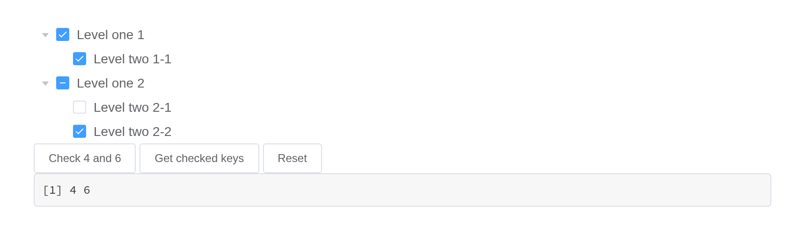

# Tree

Display a set of data with hierarchies. Nodes are
`list(id =, label =, children =)`;
[`df_to_tree_data()`](https://kaipingyang.github.io/shiny.element/reference/df_to_tree_data.md)
builds them from a data frame. `input$<id>` is the key of the node last
clicked, `input$<id>_checked` the keys checked.

## Basic usage

``` r

levels <- list(
  list(id = 1, label = "Level one 1", children = list(
    list(id = 4, label = "Level two 1-1", children = list(list(id = 9, label = "Level three 1-1-1"))))),
  list(id = 2, label = "Level one 2", children = list(
    list(id = 5, label = "Level two 2-1"), list(id = 6, label = "Level two 2-2"))),
  list(id = 3, label = "Level one 3", children = list(
    list(id = 7, label = "Level two 3-1"), list(id = 8, label = "Level two 3-2"))))
el_tree("basic", data = levels, node_key = "id")
```

## Selectable

`show_checkbox` adds a box to every node.

``` r

el_tree("pick", show_checkbox = TRUE, node_key = "id", default_expand_all = TRUE, data = list(
  list(id = "r1", label = "Region 1", children = list(list(id = "a", label = "Area A"), list(id = "b", label = "Area B"))),
  list(id = "r2", label = "Region 2")))
```

## Custom leaf node in lazy mode

With `lazy = TRUE` each node’s children come from the server, asked for
through `input$<id>_load` and answered with
[`el_load_children()`](https://kaipingyang.github.io/shiny.element/reference/el_load_children.md);
`is_leaf_field` names the field that says a node has none.

``` r

ui <- el_page(el_tree("zones", lazy = TRUE, node_key = "id", show_checkbox = TRUE,
                      is_leaf_field = "leaf"))

server <- function(input, output, session) {
  observeEvent(input$zones_load, {
    q <- input$zones_load
    kids <- if (q$level == 0) list(list(id = "region", label = "region"))
            else lapply(1:2, function(i) list(id = paste0(q$key, i), label = paste0("zone", i),
                                               leaf = q$level >= 2))
    el_load_children(id = "zones", request = q, children = kids)
  })
}

shinyApp(ui, server)
```


## Disabled checkbox

``` r

el_tree("dis", show_checkbox = TRUE, node_key = "id", default_expand_all = TRUE, data = list(
  list(id = 1, label = "Level one 1", children = list(
    list(id = 3, label = "Level two 2-1", children = list(
      list(id = 4, label = "Level three 3-1-1"),
      list(id = 5, label = "Level three 3-1-2", disabled = TRUE))),
    list(id = 2, label = "Level two 2-2", disabled = TRUE)))))
```

## Default expanded and default checked

`expanded` and `checked` are Element’s `default-expanded-keys` and
`default-checked-keys` – renamed, since `update_el_tree(checked =)`
changes them later.

``` r

el_tree("defs", show_checkbox = TRUE, node_key = "id", expanded = c(2, 3), checked = 5, data = list(
  list(id = 1, label = "Level one 1", children = list(list(id = 4, label = "Level two 1-1"))),
  list(id = 2, label = "Level one 2", children = list(
    list(id = 5, label = "Level two 2-1"), list(id = 6, label = "Level two 2-2"))),
  list(id = 3, label = "Level one 3", children = list(
    list(id = 7, label = "Level two 3-1"), list(id = 8, label = "Level two 3-2")))))
```

## Checking tree nodes

`update_el_tree(checked =)` sets them;
[`el_call()`](https://kaipingyang.github.io/shiny.element/reference/el_call.md)
runs Element’s `getCheckedKeys()`, `setCheckedKeys()` and the rest, a
value coming back as `input$<id>_get_checked_keys`.

``` r

nodes <- list(
  list(id = 1, label = "Level one 1", children = list(list(id = 4, label = "Level two 1-1"))),
  list(id = 2, label = "Level one 2", children = list(
    list(id = 5, label = "Level two 2-1"), list(id = 6, label = "Level two 2-2"))))

ui <- el_page(
  el_tree("tree", data = nodes, show_checkbox = TRUE, node_key = "id", default_expand_all = TRUE),
  el_button("set", "Check 4 and 6", size = "small"), el_button("get", "Get checked keys", size = "small"),
  el_button("reset", "Reset", size = "small"), verbatimTextOutput("keys"))

server <- function(input, output, session) {
  observeEvent(input$set, update_el_tree(id = "tree", checked = c(4, 6)))
  observeEvent(input$reset, update_el_tree(id = "tree", checked = character(0)))
  observeEvent(input$get, el_call(session, "tree", "getCheckedKeys"))
  output$keys <- renderPrint(input$tree_checked)
}

shinyApp(ui, server)
```



## Custom node content

The default slot, scoped with `node` and `data`, draws each node.

``` r

el_tree("cus", node_key = "id", default_expand_all = TRUE, expand_on_click_node = FALSE,
  data = list(list(id = 1, label = "Level one 1", children = list(list(id = 4, label = "Level two 1-1")))),
  slots = list(default = template(
    tags$span(style = "flex: 1; display: flex; justify-content: space-between; padding-right: 8px",
      tags$span("{{ node.label }}"),
      tags$span(el$button(type = "text", size = "mini", "Append"),
                el$button(type = "text", size = "mini", "Delete"))),
    scope = "{ node, data }")))
```

## Tree node filtering

[`filter()`](https://rdrr.io/r/stats/filter.html) keeps the nodes whose
label contains the text; give `filter_node_method` to decide otherwise.

``` r

ui <- el_page(
  el_input("q", placeholder = "Filter keyword", width = "300px"),
  el_tree("filtered", node_key = "id", default_expand_all = TRUE, data = list(
    list(id = 1, label = "Level one 1", children = list(list(id = 4, label = "Level two 1-1"))),
    list(id = 2, label = "Level one 2", children = list(list(id = 5, label = "Level three 2-1"))))))

server <- function(input, output, session) {
  observeEvent(input$q, el_call(session, "filtered", "filter", list(input$q), result = FALSE))
}

shinyApp(ui, server)
```


## Accordion

Only one node of a level open at a time.

``` r

el_tree("acc", accordion = TRUE, node_key = "id", data = list(
  list(id = 1, label = "Level one 1", children = list(list(id = 4, label = "Level two 1-1"))),
  list(id = 2, label = "Level one 2", children = list(list(id = 5, label = "Level two 2-1")))))
```

## Draggable

`draggable` lets nodes be dragged; `allow_drag` and `allow_drop`,
[`JS()`](https://kaipingyang.github.io/shiny.element/reference/JS.md)
functions, say which and where, and `input$<id>_node_drop` reports where
one landed.

``` r

el_tree("drag", draggable = TRUE, node_key = "id", default_expand_all = TRUE,
  allow_drop = JS("function(dragging, drop, type) {",
                  "  return drop.data.label !== 'Level two 3-1' || type !== 'inner';",
                  "}"),
  data = list(
    list(id = 1, label = "Level one 1", children = list(list(id = 4, label = "Level two 1-1"))),
    list(id = 3, label = "Level one 3", children = list(list(id = 7, label = "Level two 3-1")))))
```

## API

### Attributes

| Element | In R | Description | Type | Accepted | Default |
|----|----|----|----|----|----|
| `data` | `data` | tree data | array | — | — |
| `empty-text` | `empty_text` | text displayed when data is void | string | — | — |
| `node-key` | `node_key` | unique identity key name for nodes, its value should be unique across the whole tree | string | — | — |
| `props` | `label_field, children_field, disabled_field, is_leaf_field` | configuration options, see the following table | object | — | — |
| `render-after-expand` | `render_after_expand` | whether to render child nodes only after a parent node is expanded for the first time | boolean | — | true |
| `load` | `load` | method for loading subtree data, only works when `lazy` is true | function(node, resolve) | — | — |
| `render-content` | `render_content` | render function for tree node | Function(h, { node, data, store } | — | — |
| `highlight-current` | `highlight_current` | whether current node is highlighted | boolean | — | false |
| `default-expand-all` | `default_expand_all` | whether to expand all nodes by default | boolean | — | false |
| `expand-on-click-node` | `expand_on_click_node` | whether to expand or collapse node when clicking on the node, if false, then expand or collapse node only when clicking on the arrow icon. | boolean | — | true |
| `check-on-click-node` | `check_on_click_node` | whether to check or uncheck node when clicking on the node, if false, the node can only be checked or unchecked by clicking on the checkbox. | boolean | — | false |
| `auto-expand-parent` | `auto_expand_parent` | whether to expand father node when a child node is expanded | boolean | — | true |
| `default-expanded-keys` | `expanded` | array of keys of initially expanded nodes | array | — | — |
| `show-checkbox` | `show_checkbox` | whether node is selectable | boolean | — | false |
| `check-strictly` | `check_strictly` | whether checked state of a node not affects its father and child nodes when `show-checkbox` is `true` | boolean | — | false |
| `default-checked-keys` | `checked` | array of keys of initially checked nodes | array | — | — |
| `current-node-key` | `current_node_key` | key of initially selected node | string, number | — | — |
| `filter-node-method` | `filter_node_method` | this function will be executed on each node when use filter method. if return `false`, tree node will be hidden. | Function(value, data, node) | — | — |
| `accordion` | `accordion` | whether only one node among the same level can be expanded at one time | boolean | — | false |
| `indent` | `indent` | horizontal indentation of nodes in adjacent levels in pixels | number | — | 16 |
| `icon-class` | `icon_class` | custome tree node icon | string | \- | \- |
| `lazy` | `lazy` | whether to lazy load leaf node, used with `load` attribute | boolean | — | false |
| `draggable` | `draggable` | whether enable tree nodes drag and drop | boolean | — | false |
| `allow-drag` | `allow_drag` | this function will be executed before dragging a node. If `false` is returned, the node can not be dragged | Function(node) | — | — |
| `allow-drop` | `allow_drop` | this function will be executed before the dragging node is dropped. If `false` is returned, the dragging node can not be dropped at the target node. `type` has three possible values: ‘prev’ (inserting the dragging node before the target node), ‘inner’ (inserting the dragging node to the target node) and ‘next’ (inserting the dragging node after the target node) | Function(draggingNode, dropNode, type) | — | — |

### Method

| Element | In R | Description |
|----|----|----|
| `filter` | `el_call(session, id, "filter")` | filter all tree nodes, filtered nodes will be hidden |
| `updateKeyChildren` | `el_call(session, id, "updateKeyChildren")` | set new data to node, only works when `node-key` is assigned |
| `getCheckedNodes` | `el_call(session, id, "getCheckedNodes")` | If the node can be selected (`show-checkbox` is `true`), it returns the currently selected array of nodes |
| `setCheckedNodes` | `el_call(session, id, "setCheckedNodes")` | set certain nodes to be checked, only works when `node-key` is assigned |
| `getCheckedKeys` | `el_call(session, id, "getCheckedKeys")` | If the node can be selected (`show-checkbox` is `true`), it returns the currently selected array of node’s keys |
| `setCheckedKeys` | `el_call(session, id, "setCheckedKeys")` | set certain nodes to be checked, only works when `node-key` is assigned |
| `setChecked` | `el_call(session, id, "setChecked")` | set node to be checked or not, only works when `node-key` is assigned |
| `getHalfCheckedNodes` | `el_call(session, id, "getHalfCheckedNodes")` | If the node can be selected (`show-checkbox` is `true`), it returns the currently half selected array of nodes |
| `getHalfCheckedKeys` | `el_call(session, id, "getHalfCheckedKeys")` | If the node can be selected (`show-checkbox` is `true`), it returns the currently half selected array of node’s keys |
| `getCurrentKey` | `el_call(session, id, "getCurrentKey")` | return the highlight node’s key (null if no node is highlighted) |
| `getCurrentNode` | `el_call(session, id, "getCurrentNode")` | return the highlight node’s data (null if no node is highlighted) |
| `setCurrentKey` | `el_call(session, id, "setCurrentKey")` | set highlighted node by key, only works when `node-key` is assigned |
| `setCurrentNode` | `el_call(session, id, "setCurrentNode")` | set highlighted node, only works when `node-key` is assigned |
| `getNode` | `el_call(session, id, "getNode")` | get node by data or key |
| `remove` | `el_call(session, id, "remove")` | remove a node, only works when node-key is assigned |
| `append` | `el_call(session, id, "append")` | append a child node to a given node in the tree |
| `insertBefore` | `el_call(session, id, "insertBefore")` | insert a node before a given node in the tree |
| `insertAfter` | `el_call(session, id, "insertAfter")` | insert a node after a given node in the tree |

### Events

| Element | In R | Description |
|----|----|----|
| `node-click` | one of the component’s inputs – see its reference page | triggers when a node is clicked |
| `node-contextmenu` | `input$<id>_node_contextmenu` | triggers when a node is clicked by right button |
| `check-change` | `input$<id>_check_change` | triggers when the selected state of the node changes |
| `check` | one of the component’s inputs – see its reference page | triggers after clicking the checkbox of a node |
| `current-change` | `input$<id>_current_change` | triggers when current node changes |
| `node-expand` | `input$<id>_node_expand` | triggers when current node open |
| `node-collapse` | `input$<id>_node_collapse` | triggers when current node close |
| `node-drag-start` | `input$<id>_node_drag_start` | triggers when dragging starts |
| `node-drag-enter` | `input$<id>_node_drag_enter` | triggers when the dragging node enters another node |
| `node-drag-leave` | `input$<id>_node_drag_leave` | triggers when the dragging node leaves a node |
| `node-drag-over` | `input$<id>_node_drag_over` | triggers when dragging over a node (like mouseover event) |
| `node-drag-end` | `input$<id>_node_drag_end` | triggers when dragging ends |
| `node-drop` | `input$<id>_node_drop` | triggers after the dragging node is dropped |
