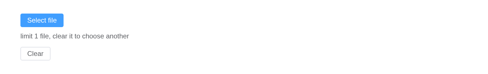

# Upload

Upload files by clicking or drag-and-drop.

## Basic Usage

Customize upload button type and text using `slot`. Set `limit` and
`on-exceed` to limit the maximum number of uploads allowed and specify
method when the limit is exceeded. Plus, you can abort removing a file
in the `before-remove` hook.

The files go through Shiny’s own upload channel, so `input$<id>` is the
data frame [`fileInput()`](https://rdrr.io/pkg/shiny/man/fileInput.html)
gives – `name`, `size`, `type`, `datapath` – while Element Plus draws
the list and the progress. `limit` caps the number of files; `on_exceed`
hears when there are more.

``` r

ui <- el_page(
  el_upload(
    "docs",
    button_label = "Click to upload",
    multiple = TRUE,
    limit = 3,
    tip = "jpg/png files with a size less than 500kb",
    on_exceed = JS(
      "function(files, list) {",
      "  ElementPlus.ElMessage.warning('3 files at most');",
      "}"
    )
  ),
  tableOutput("files")
)

server <- function(input, output, session) {
  output$files <- renderTable(input$docs[, c("name", "size", "type")])
}

shinyApp(ui, server)
```


## Cover Previous File

Set `limit` and `on-exceed` to automatically replace the previous file
when select a new file.

With `limit = 1`, one file at a time: `on_exceed` hears the next, and
the server clears the list with
[`el_upload_clear()`](https://kaipingyang.github.io/shiny.element/reference/el_upload_clear.md)
so a new one can come.

``` r

ui <- el_page(
  el_upload(
    "one",
    limit = 1,
    auto_upload = FALSE,
    button_label = "Select file",
    tip = "limit 1 file, clear it to choose another",
    on_exceed = JS(
      "function() { ElementPlus.ElMessage.warning('Clear the file first'); }"
    )
  ),
  el_button("clear", "Clear", size = "small")
)

server <- function(input, output, session) {
  observeEvent(input$clear, el_upload_clear(id = "one"))
}

shinyApp(ui, server)
```



## User Avatar

Use `before-upload` hook to limit the upload file format and size.

One picture, no list: the slot draws the box, a
[`JS()`](https://kaipingyang.github.io/shiny.element/reference/JS.md)
hook checks the file before it goes.

``` r

tagList(
  tags$style(
    ".avatar-uploader .el-upload { border: 1px dashed var(--el-border-color);",
    " border-radius: 6px; width: 178px; height: 178px; display: flex;",
    " align-items: center; justify-content: center; font-size: 28px; color: #8c939d; }"
  ),
  tags$div(
    class = "avatar-uploader",
    el_upload(
      "avatar",
      show_file_list = FALSE,
      accept = "image/*",
      before_upload = JS(
        "function(file) {",
        "  if (file.size / 1024 / 1024 > 2) {",
        "    ElementPlus.ElMessage.error('Avatar picture size can not exceed 2MB!');",
        "    return false;",
        "  }",
        "  return true;",
        "}"
      ),
      slots = list(default = el_icon("Plus"))
    )
  )
)
```

## Photo Wall

Use `list-type` to change the fileList style.

`list_type = "picture-card"`: each file a card with its thumbnail, drawn
in the browser from the file itself.

``` r

el_upload(
  "photos",
  list_type = "picture-card",
  accept = "image/*",
  multiple = TRUE,
  file_list = list(list(
    name = "food.jpeg",
    url = "https://fuss10.elemecdn.com/3/63/4e7f3a15429bfda99bce42a18cdd1jpeg.jpeg"
  ))
)
```

## Custom Thumbnail

Use `scoped-slot` to change default thumbnail template.

The `file` slot, scoped with `file`, draws each card.

``` r

el_upload(
  "thumbs",
  list_type = "picture-card",
  auto_upload = FALSE,
  accept = "image/*",
  slots = list(
    default = el_icon("Plus"),
    file = template(
      tags$div(
        tags$img(
          class = "el-upload-list__item-thumbnail",
          `:src` = "file.url",
          alt = ""
        ),
        tags$span(
          class = "el-upload-list__item-actions",
          tags$span(class = "el-upload-list__item-delete", "{{ file.name }}")
        )
      ),
      slot = "file",
      scope = "{ file }"
    )
  )
)
```

## File List with Thumbnail

``` r

el_upload(
  "pics",
  list_type = "picture",
  button_label = "Click to upload",
  tip = "jpg/png files with a size less than 500kb",
  accept = "image/*",
  file_list = list(list(
    name = "food.jpeg",
    url = "https://fuss10.elemecdn.com/3/63/4e7f3a15429bfda99bce42a18cdd1jpeg.jpeg"
  ))
)
```

## File List Control

Use `on-change` hook function to control upload file list.

`on_change` sees the list change; keeping only the last three files is a
line of JavaScript.

``` r

el_upload(
  "latest",
  button_label = "Click to upload",
  tip = "jpg/png files with a size less than 500kb",
  on_change = JS(
    "function(file, fileList) { if (fileList.length > 3) fileList.splice(0, fileList.length - 3); }"
  )
)
```

## Drag to Upload

You can drag your file to a certain area to upload it.

``` r

el_upload(
  "dropped",
  drag = TRUE,
  multiple = TRUE,
  button_label = "Drop file here or click to upload",
  tip = "jpg/png files with a size less than 500kb"
)
```

## Upload Directory

Enable folder upload via the `directory` prop.

After enabling it, only folders can be selected, and after selecting a
folder, the files within the folder will be flattened.

`directory = TRUE` picks a folder, and uploads every file in it.

``` r

el_upload("folder", directory = TRUE, button_label = "Upload directory")
```

## Manual Upload

`auto_upload = FALSE` keeps the files until `submit()` sends them – from
the server, with
[`el_call()`](https://kaipingyang.github.io/shiny.element/reference/el_call.md).

``` r

ui <- el_page(
  el_upload(
    "queued",
    auto_upload = FALSE,
    multiple = TRUE,
    button_label = "Select file",
    tip = "Chosen files wait for the button"
  ),
  el_button("send", "Upload to server", type = "success", size = "small"),
  tableOutput("arrived")
)

server <- function(input, output, session) {
  observeEvent(input$send, el_call(id = "queued", method = "submit"))
  output$arrived <- renderTable(input$queued[, c("name", "size")])
}

shinyApp(ui, server)
```


## API

Element Plus’s tables, and beside each entry where it is in R.

### Attributes

| Element | In R | Description | Type | Accepted | Default |
|----|----|----|----|----|----|
| `action` | `action` | request URL. | [^1] |  | \# |
| `headers` | `headers` | request headers. | [^2]`Headers \\| Record<string, any>` |  | — |
| `multiple` | `multiple` | whether uploading multiple files is permitted. | [^3] |  | false |
| `data` | `extra_data` | additions options of request. support `Awaitable` data and `Function` since v2.3.13. | [^4]`Record<string, any> \\| Awaitable<Record<string, any>>` / [^5]`(rawFile: UploadRawFile) => Awaitable<Record<string, any>>` |  | {} |
| `with-credentials` | `with_credentials` | whether cookies are sent. | [^6] |  | false |
| `show-file-list` | `show_file_list` | whether to show the uploaded file list. | [^7] |  | true |
| `drag` | `drag` | whether to activate drag and drop mode. | [^8] |  | false |
| `accept` | `accept` | accepted [file types](https://developer.mozilla.org/en-US/docs/Web/HTML/Element/input#attr-accept), will not work when `thumbnail-mode === true`. | [^9] |  | ’’ |
| `crossorigin` | `crossorigin` | native attribute [crossorigin](https://developer.mozilla.org/en-US/docs/Web/HTML/Attributes/crossorigin). | [^10]`'' \\| 'anonymous' \\| 'use-credentials'` |  | — |
| `on-preview` | `on_preview` | hook function when clicking the uploaded files. | [^11]`(uploadFile: UploadFile) => void` |  | — |
| `on-remove` | `on_remove` | hook function when files are removed. | [^12]`(uploadFile: UploadFile, uploadFiles: UploadFiles) => void` |  | — |
| `on-success` | `input$<id>` | hook function when uploaded successfully. | [^13]`(response: any, uploadFile: UploadFile, uploadFiles: UploadFiles) => void` |  | — |
| `on-error` | `input$<id>_error` | hook function when some errors occurs. | [^14]`(error: Error, uploadFile: UploadFile, uploadFiles: UploadFiles) => void` |  | — |
| `on-progress` | `on_progress` | hook function when some progress occurs. | [^15]`(evt: UploadProgressEvent, uploadFile: UploadFile, uploadFiles: UploadFiles) => void` |  | — |
| `on-change` | `on_change` | hook function when select file or upload file success or upload file fail. | [^16]`(uploadFile: UploadFile, uploadFiles: UploadFiles) => void` |  | — |
| `on-exceed` | `on_exceed` | hook function when limit is exceeded. | [^17]`(files: File[], uploadFiles: UploadUserFile[]) => void` |  | — |
| `before-upload` | `before_upload` | hook function before uploading with the file to be uploaded as its parameter. If `false` is returned or a `Promise` is returned and then is rejected, uploading will be aborted. | [^18]`(rawFile: UploadRawFile) => Awaitable<void \\| undefined \\| null \\| boolean \\| File \\| Blob>` |  | — |
| `before-remove` | `before_remove` | hook function before removing a file with the file and file list as its parameters. If `false` is returned or a `Promise` is returned and then is rejected, removing will be aborted. | [^19]`(uploadFile: UploadFile, uploadFiles: UploadFiles) => Awaitable<boolean>` |  | — |
| `file-list` | `file_list` | default uploaded files. | [^20]`UploadUserFile[]` |  | \[\] |
| `list-type` | `list_type` | type of file list. | [^21]`'text' \\| 'picture' \\| 'picture-card'` |  | text |
| `auto-upload` | `auto_upload` | whether to auto upload file. | [^22] |  | true |
| `http-request` | `(the Shiny upload)` | override default xhr behavior, allowing you to implement your own upload-file’s request. | [^23]`(options: UploadRequestOptions) => XMLHttpRequest \\| Promise<unknown>` |  | ajaxUpload [see](https://github.com/element-plus/element-plus/blob/dev/packages/components/upload/src/ajax.ts#L55) |
| `disabled` | `disabled` | whether to disable upload. | [^24] |  | false |
| `limit` | `limit` | maximum number of uploads allowed. | [^25] |  | — |
| `directory` | `directory` | whether to support uploading directory. After enabling it, only folders can be selected, and after selecting a folder, the files within the folder will be flattened. | [^26] |  | false |

### Slots

| Element   | In R                       | Description                         |
|-----------|----------------------------|-------------------------------------|
| `default` | default content            | customize default content.          |
| `trigger` | `slots = list(trigger = )` | content which triggers file dialog. |
| `tip`     | `slots = list(tip = )`     | content of tips.                    |
| `file`    | `slots = list(file = )`    | content of thumbnail template.      |

### Exposes

| Element | In R | Description |
|----|----|----|
| `abort` | `el_call(session, id, "abort")` | cancel upload request. When a `file` is specified, abort the corresponding pending upload; when no file is specified, abort all pending uploads. |
| `submit` | `el_call(session, id, "submit")` | upload the file list manually. |
| `clearFiles` | `el_call(session, id, "clearFiles")` | clear the file list (this method is not supported in the `before-upload` hook). |
| `handleStart` | `el_call(session, id, "handleStart")` | select the file manually. |
| `handleRemove` | `el_call(session, id, "handleRemove")` | remove the file manually. `file` and `rawFile` has been merged. `rawFile` will be removed in `v2.2.0`. |

[^1]: string

[^2]: object

[^3]: boolean

[^4]: object

[^5]: Function

[^6]: boolean

[^7]: boolean

[^8]: boolean

[^9]: string

[^10]: enum

[^11]: Function

[^12]: Function

[^13]: Function

[^14]: Function

[^15]: Function

[^16]: Function

[^17]: Function

[^18]: Function

[^19]: Function

[^20]: array

[^21]: enum

[^22]: boolean

[^23]: Function

[^24]: boolean

[^25]: number

[^26]: boolean
