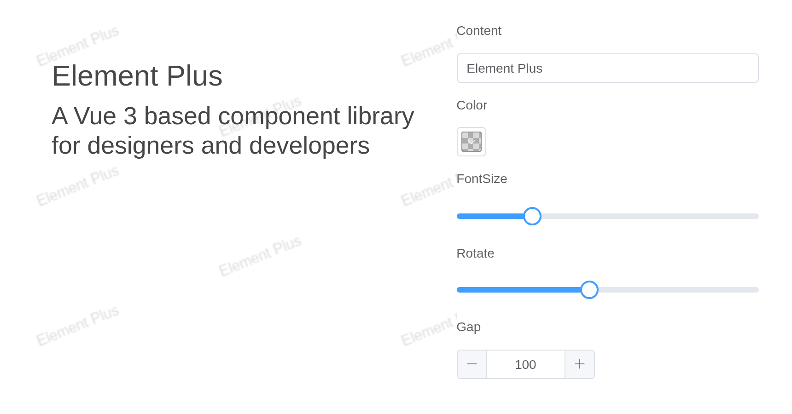

# Watermark

Add specific text or patterns to the page.

## Basic usage

The most basic usage.

``` r

el_watermark(content = "Element Plus", font = list(color = "rgba(0, 0, 0, .15)"),
             tags$div(style = "height: 500px"))
```

## Multi-line watermark

Use `content` to set an array of strings to specify multi-line text
watermark content.

Several lines: `content` is a vector.

``` r

el_watermark(content = c("Element+", "Element Plus"), font = list(color = "rgba(0, 0, 0, .15)"),
             tags$div(style = "height: 500px"))
```

## Image watermark

Specify the image address via `image`. To ensure that the image is high
definition and not stretched, set the width and height, and upload at
least twice the width and height of the logo image address.

`image` draws a picture instead of text; `watermark_width` and `height`
size it (`width` is the box’s).

``` r

el_watermark(watermark_width = 130, height = 30,
             image = "https://element-plus.org/images/element-plus-logo.svg",
             tags$div(style = "height: 500px"))
```

## Custom configuration

Preview the watermark effect by configuring custom parameters.

Its settings from inputs: the server redraws it as they change.

``` r

ui <- el_page(
  el_row(
    el_col(span = 14, uiOutput("marked")),
    el_col(span = 10,
      el_input("content", label = "Content", value = "Element Plus"),
      el_color_picker("color", label = "Color", value = "rgba(0, 0, 0, 0.15)", show_alpha = TRUE),
      el_slider("size", label = "FontSize", value = 16, min = 8, max = 40),
      el_slider("rotate", label = "Rotate", value = -22, min = -180, max = 180),
      el_input_number("gap", label = "Gap", value = 100))))

server <- function(input, output, session) {
  output$marked <- renderUI(el_watermark(
    content = input$content, rotate = input$rotate, gap = rep(input$gap %||% 100, 2),
    font = list(fontSize = input$size, color = input$color),
    tags$div(style = "padding: 40px 20px; height: 360px",
             tags$h1("Element Plus"),
             tags$h2("A Vue 3 based component library for designers and developers"))))
}

shinyApp(ui, server)
```



## API

Element Plus’s tables, and beside each entry where it is in R.

### Attributes

| Element | In R | Description | Type | Accepted | Default |
|----|----|----|----|----|----|
| `width` | `width` | The width of the watermark, the default value of `content` is its own width | [^1] |  | 120 |
| `height` | `height` | The height of the watermark, the default value of `content` is its own height | [^2] |  | 64 |
| `rotate` | `rotate` | When the watermark is drawn, the rotation Angle, unit `°` | [^3] |  | -22 |
| `z-index` | `z_index` | The z-index of the appended watermark element | [^4] |  | 9 |
| `image` | `image` | Image source, it is recommended to export 2x or 3x image, high priority | [^5] |  | — |
| `content` | `content` | Watermark text content | [^6]/[^7]`string[]` |  | Element Plus |
| `font` | `font` | Text style | [Font](#font) |  | [Font](#font) |
| `gap` | `gap` | The spacing between watermarks | [^8]`[number, number]` |  | 
``` math
100, 100
``` |
| `offset` | `offset` | The offset of the watermark from the upper left corner of the container. The default is `gap/2` | [^9]`[number, number]` |  | \$\$gap\\0\$\$/2, gap
``` math
1
```
/2\] |

### Slots

| Element   | In R            | Description                    |
|-----------|-----------------|--------------------------------|
| `default` | default content | container for adding watermark |

[^1]: number

[^2]: number

[^3]: number

[^4]: number

[^5]: string

[^6]: string

[^7]: array

[^8]: array

[^9]: array
