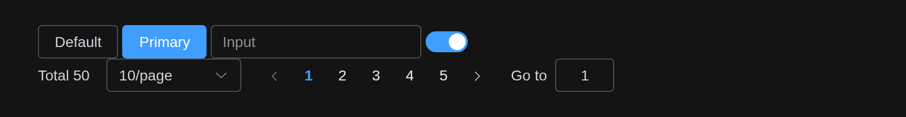
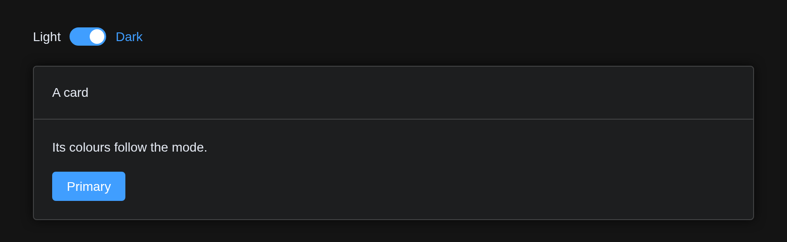

# Dark Mode

Element Plus has a dark mode: its CSS variables, redefined under the
class `dark` on `<html>`. The stylesheet ships with the package and
every page loads it, so dark mode is a class away.

## How to enable it?

Add `class = "dark"` to the page’s `<html>` – once, from the UI:

``` r

ui <- el_page(
  tags$script("document.documentElement.classList.add('dark');"),
  tags$style(
    "html.dark body { background: var(--el-bg-color); color: var(--el-text-color-primary); }"
  ),
  el_button("b1", "Default"),
  el_button("b2", "Primary", type = "primary"),
  el_input("i", placeholder = "Input", width = "200px"),
  el_switch("s", value = TRUE),
  el_pagination("p", total = 50)
)

shinyApp(ui, function(input, output, session) {})
```



Or let the user switch, the server toggling the class:

``` r

ui <- el_page(
  tags$script(HTML(
    "Shiny.addCustomMessageHandler('dark', function (on) {",
    "  document.documentElement.classList.toggle('dark', on);",
    "});"
  )),
  tags$style(
    "html.dark body { background: var(--el-bg-color); color: var(--el-text-color-primary); }"
  ),
  el_switch("dark", active_text = "Dark", inactive_text = "Light"),
  tags$div(
    style = "margin-top: 16px",
    el_card(
      header = "A card",
      tags$p("Its colours follow the mode."),
      el_button("go", "Primary", type = "primary")
    )
  )
)

server <- function(input, output, session) {
  observeEvent(
    input$dark,
    session$sendCustomMessage("dark", isTRUE(input$dark))
  )
}

shinyApp(ui, server)
```



The page around the components is Bootstrap’s: the `tags$style()` above
gives its background and text Element Plus’s dark colours.

## With bslib

Bootstrap has a dark mode of its own, `data-bs-theme="dark"` on
`<html>`, and bslib’s
[`input_dark_mode()`](https://rstudio.github.io/bslib/reference/input_dark_mode.html)
switches it. The components follow: while the page has `data-bs-theme`,
the class `dark` goes with it, so one switch turns Bootstrap and Element
Plus together.

``` r

theme <- el_theme()
ui <- page_sidebar(
  theme = theme,
  use_element(theme = theme),
  sidebar = sidebar(input_dark_mode(id = "mode")),
  el_input("i", placeholder = "Input"),
  el_button("b", "Primary", type = "primary")
)
```

## Custom variables

A dark theme of your own overrides Element Plus’s variables under
`html.dark`:

``` r

tags$style(
  "html.dark {
  --el-bg-color: #141414;
  --el-color-primary: #3b82f6;
}"
)
```

A brand colour given to
[`el_theme()`](https://kaipingyang.github.io/shiny.element/reference/el_theme.md)
gets its dark tints too:
[`el_page()`](https://kaipingyang.github.io/shiny.element/reference/el_page.md)
mixes them against the dark background, as Element Plus’s dark
stylesheet does for its own blue.
