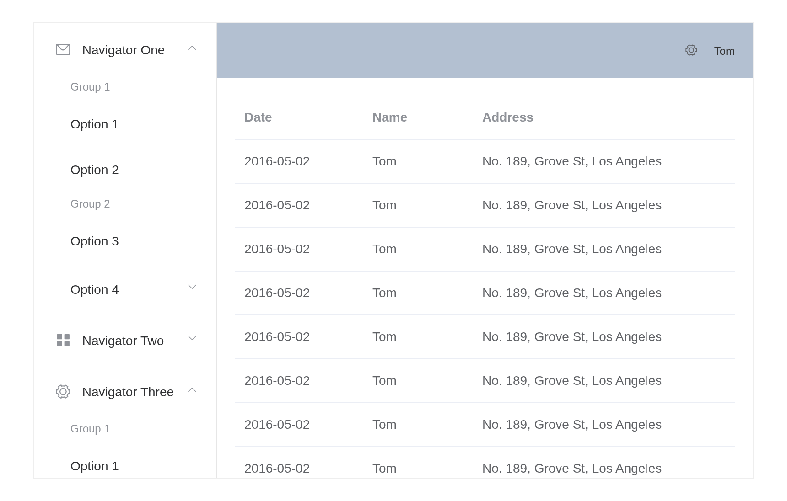
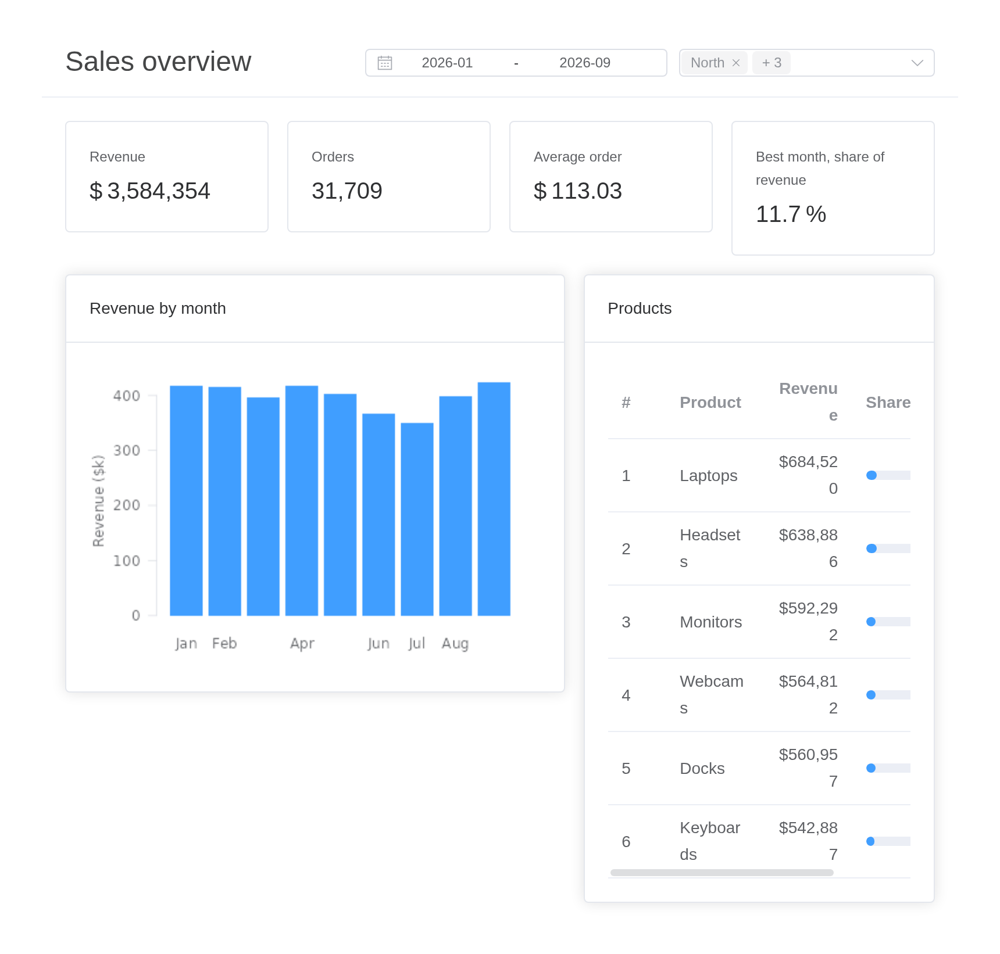
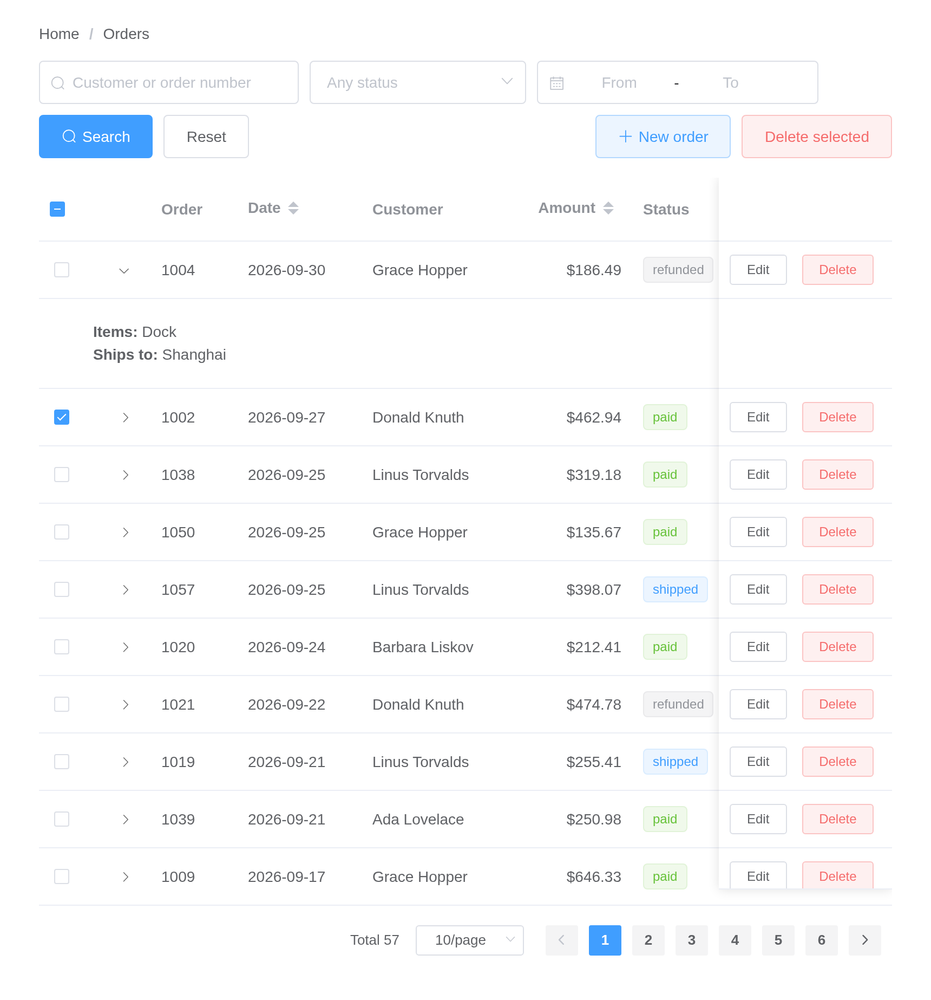
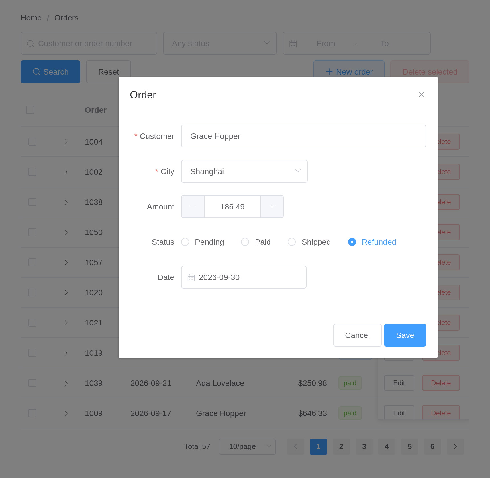

# Dashboards

Whole apps, built from the layout components and the controls together.
Each is a file under `examples/dashboards/` in the installed package, so
it can be run as it stands –
`shiny::runApp(system.file("examples/dashboards/sales", package = "shiny.element"))`.

## Element’s own layout example

Element’s documentation closes its Container page with an admin layout:
a side menu of grouped options, a header holding a dropdown, and a table
in the main area. Here it is in R, piece for piece:

``` r

# Element UI's own "Container" example, rebuilt in R: a side menu, a header
# with a dropdown, and a table in the main area.
#
#   shiny::runApp(system.file("examples/dashboards/admin-layout", package = "shiny.element"))

library(shiny)
library(shiny.element)

rows <- data.frame(
  date    = rep("2016-05-02", 20),
  name    = rep("Tom", 20),
  address = rep("No. 189, Grove St, Los Angeles", 20)
)

# One navigator: two titled groups and a nested submenu, as upstream has it
navigator <- function(i, icon, label) {
  sub <- function(n) paste0(i, "-", n)
  list(index = as.character(i), label = label, icon = icon, children = list(
    list(group = TRUE, title = "Group 1", children = list(
      list(index = sub(1), label = "Option 1"),
      list(index = sub(2), label = "Option 2"))),
    list(group = TRUE, title = "Group 2", children = list(
      list(index = sub(3), label = "Option 3"))),
    list(index = sub(4), label = "Option 4", children = list(
      list(index = sub("4-1"), label = "Option 4-1")))
  ))
}

ui <- el_page(
  el_container(
    style = "height: 500px; border: 1px solid #eee",
    el_aside(
      width = "200px", style = "background-color: rgb(238, 241, 246)",
      el_menu("nav", default_openeds = c("1", "3"), items = list(
        navigator(1, "el-icon-message", "Navigator One"),
        navigator(2, "el-icon-menu", "Navigator Two"),
        navigator(3, "el-icon-setting", "Navigator Three")
      ))
    ),
    el_container(
      el_header(
        style = "text-align: right; font-size: 12px; background-color: #B3C0D1;
                 color: #333; line-height: 60px",
        el_dropdown("account",
          trigger_label = tags$i(class = "el-icon-setting",
                                 style = "margin-right: 15px"),
          items = list(list(command = "view", label = "View"),
                       list(command = "add", label = "Add"),
                       list(command = "delete", label = "Delete"))),
        tags$span("Tom")
      ),
      el_main(
        el_table("people", data = rows, columns = list(
          list(prop = "date", label = "Date", width = "140"),
          list(prop = "name", label = "Name", width = "120"),
          list(prop = "address", label = "Address")
        ))
      )
    )
  )
)

server <- function(input, output, session) {
  observeEvent(input$nav, {
    el_message(session, paste("Navigated to", input$nav))
  })
  observeEvent(input$account, {
    el_message(session, paste("Account:", input$account), type = "info")
  })
}

shinyApp(ui, server)
```



## A sales overview

Filters in the header drive everything below them: the headline numbers
are
[`el_statistic()`](https://kaipingyang.github.io/shiny.element/reference/el_statistic.md)s
moved with
[`update_el_statistic()`](https://kaipingyang.github.io/shiny.element/reference/update_el_statistic.md),
the chart is an ordinary
[`plotOutput()`](https://rdrr.io/pkg/shiny/man/plotOutput.html), and the
products table renders a progress bar in a cell with a `cell` template.

``` r

# A sales overview: filters in the header, headline numbers in cards, a
# chart and a ranked table, all following the filters.
#
#   shiny::runApp(system.file("examples/dashboards/sales", package = "shiny.element"))

library(shiny)
library(shiny.element)

set.seed(42)
months  <- seq(as.Date("2026-01-01"), by = "month", length.out = 9)
regions <- c("North", "South", "East", "West")
products <- c("Laptops", "Monitors", "Keyboards", "Headsets", "Docks", "Webcams")
sales <- expand.grid(month = months, region = regions, product = products,
                     stringsAsFactors = FALSE)
sales$revenue <- round(runif(nrow(sales), 2, 30) * 1000)
sales$orders  <- round(sales$revenue / runif(nrow(sales), 80, 160))

kpi_card <- function(id, title, prefix = NULL, suffix = NULL, precision = 0) {
  el_col(span = 6, el_card(shadow = "hover",
    el_statistic(id, value = 0, title = title, prefix = prefix,
                 suffix = suffix, precision = precision, group_separator = ",")))
}

ui <- el_page(
  el_container(
    el_header(
      style = "display: flex; align-items: center; justify-content: space-between;
               border-bottom: 1px solid #ebeef5",
      tags$h3("Sales overview", style = "margin: 0"),
      tags$div(style = "display: flex; gap: 10px",
        el_date_picker("span", type = "monthrange", value = c("2026-01", "2026-09"),
                       value_format = "yyyy-MM", format = "yyyy-MM",
                       start_placeholder = "From", end_placeholder = "To",
                       width = "260px", size = "small"),
        el_select("region", choices = regions, selected = regions, multiple = TRUE,
                  collapse_tags = TRUE, size = "small", width = "220px"))
    ),
    el_main(
      el_row(gutter = 16,
        kpi_card("revenue", "Revenue", prefix = "$"),
        kpi_card("orders", "Orders"),
        kpi_card("basket", "Average order", prefix = "$", precision = 2),
        kpi_card("best", "Best month, share of revenue", suffix = "%", precision = 1)
      ),
      el_row(gutter = 16, style = "margin-top: 16px",
        el_col(span = 14, el_card(header = "Revenue by month",
          plotOutput("trend", height = "260px"))),
        el_col(span = 10, el_card(header = "Products",
          el_table("products", columns = list(
            list(type = "index", label = "#", width = "50"),
            list(prop = "product", label = "Product"),
            list(prop = "revenue", label = "Revenue", align = "right",
                 formatter = htmlwidgets::JS(
                   "function(r, c, v) { return '$' + v.toLocaleString(); }")),
            list(prop = "share", label = "Share", width = "130",
                 cell = el$progress(":percentage" = "scope.row.share",
                                    ":stroke-width" = "8"))
          ))))
      )
    )
  )
)

server <- function(input, output, session) {
  # Both filters report on load; until they have, there is nothing to show
  picked <- reactive({
    req(input$span, input$region)
    span <- as.Date(paste0(input$span, "-01"))
    sales[sales$month >= span[1] & sales$month <= span[2] &
            sales$region %in% input$region, ]
  })

  observe({
    d <- picked()
    req(nrow(d) > 0)
    by_month <- tapply(d$revenue, d$month, sum)
    update_el_statistic(session, "revenue", value = sum(d$revenue))
    update_el_statistic(session, "orders", value = sum(d$orders))
    update_el_statistic(session, "basket",
                        value = if (sum(d$orders)) sum(d$revenue) / sum(d$orders) else 0)
    update_el_statistic(session, "best",
                        value = if (length(by_month)) 100 * max(by_month) / sum(by_month) else 0)

    by_product <- aggregate(revenue ~ product, d, sum)
    by_product <- by_product[order(-by_product$revenue), ]
    by_product$share <- round(100 * by_product$revenue / sum(by_product$revenue))
    update_el_table(session, "products", data = by_product)
  })

  output$trend <- renderPlot({
    d <- picked()
    req(nrow(d) > 0)
    by_month <- tapply(d$revenue, format(d$month, "%b"), sum)[format(unique(sort(d$month)), "%b")]
    par(mar = c(3, 4, 1, 1), family = "sans", col.axis = "#606266", fg = "#dcdfe6")
    barplot(by_month / 1000, col = "#409EFF", border = NA, las = 1,
            ylab = "Revenue ($k)", col.lab = "#606266")
  })
}

shinyApp(ui, server)
```



## An orders admin page

The table most admin pages are built around: search over it, a status
tag and a pair of buttons in each row, an expanding row for detail,
sorting and paging done by the server, a dialog holding a form to add
and edit, and a confirmation before anything is deleted. Each row’s
buttons report through `rowAction()` – `input$orders_edit` and
`input$orders_delete` carry the row.

``` r

# An orders admin page: search, a table with row actions, server-side
# sorting and paging, a dialog to add and edit, and confirmation to delete.
#
#   shiny::runApp(system.file("examples/dashboards/orders", package = "shiny.element"))

library(shiny)
library(shiny.element)

set.seed(1)
n <- 57
statuses <- c(Pending = "pending", Paid = "paid", Shipped = "shipped",
              Refunded = "refunded")
cities <- c("Beijing", "Shanghai", "Shenzhen", "Hangzhou")
seed_orders <- data.frame(
  id       = 1000 + seq_len(n),
  date     = format(as.Date("2026-09-30") - sample(0:60, n, TRUE)),
  customer = sample(c("Ada Lovelace", "Grace Hopper", "Alan Turing", "Linus Torvalds",
                      "Ken Thompson", "Barbara Liskov", "Donald Knuth"), n, TRUE),
  city     = sample(cities, n, TRUE),
  amount   = round(runif(n, 20, 900), 2),
  status   = sample(unname(statuses), n, TRUE, prob = c(.2, .4, .3, .1)),
  items    = sample(c("Laptop", "Monitor, cable", "Keyboard, mouse", "Dock"), n, TRUE)
)

# A tag type per status, chosen in the browser for each row
status_tag <- el$tag(
  size = "small",
  ":type" = paste0("({pending: 'warning', paid: 'success', shipped: '', ",
                   "refunded: 'info'})[scope.row.status]"),
  "{{ scope.row.status }}"
)

columns <- list(
  list(type = "expand", cell = tags$div(
    tags$b("Items: "), "{{ scope.row.items }}", tags$br(),
    tags$b("Ships to: "), "{{ scope.row.city }}")),
  list(prop = "id", label = "Order", width = "80"),
  list(prop = "date", label = "Date", width = "115", sortable = "custom"),
  list(prop = "customer", label = "Customer", min_width = "140"),
  list(prop = "amount", label = "Amount", width = "110", align = "right",
       sortable = "custom",
       formatter = htmlwidgets::JS("function(r, c, v) { return '$' + v.toFixed(2); }")),
  list(prop = "status", label = "Status", width = "100", cell = status_tag),
  # Pinned to the right edge, so the buttons stay in view when the table
  # is narrower than its columns and scrolls sideways
  list(label = "", width = "160", fixed = "right", cell = tagList(
    el$button(size = "mini", "@click" = "rowAction('edit', scope)", "Edit"),
    el$button(size = "mini", type = "danger", plain = NA,
              "@click" = "rowAction('delete', scope)", "Delete")))
)

ui <- el_page(
  el_breadcrumb("crumbs", items = list(list(label = "Home"), list(label = "Orders"))),
  tags$div(
    style = "display: flex; flex-wrap: wrap; gap: 10px; margin: 18px 0",
    el_input("q", placeholder = "Customer or order number", clearable = TRUE,
             prefix_icon = "el-icon-search", width = "240px"),
    el_select("status", choices = statuses, multiple = TRUE, collapse_tags = TRUE,
              placeholder = "Any status", clearable = TRUE, width = "200px"),
    el_date_picker("dates", type = "daterange", start_placeholder = "From",
                   end_placeholder = "To", width = "260px"),
    el_button("search", "Search", type = "primary", icon = "el-icon-search"),
    el_button("reset", "Reset"),
    tags$div(style = "flex: 1"),
    el_button("add", "New order", type = "primary", plain = TRUE, icon = "el-icon-plus"),
    el_button("remove_many", "Delete selected", type = "danger", plain = TRUE,
              disabled = TRUE)
  ),
  el_table("orders", selection = TRUE, row_key = "id", columns = columns,
           empty_text = "No orders match"),
  tags$div(style = "margin-top: 16px; text-align: right",
    el_pagination("pager", total = n, page_size = 10, page_sizes = c(10, 20, 50),
                  layout = "total, sizes, prev, pager, next", background = TRUE)),

  el_dialog("editor", title = "Order", width = "560px",
    # The dialog's footer holds the buttons, so the form draws none of its own
    content = el_form(id = "order_form", label_width = "90px", submit_label = NULL,
      el_form_field("customer", "input", label = "Customer",
                    rules = el_rule(required = TRUE, message = "Who is it for?")),
      el_form_field("city", "select", label = "City", choices = cities,
                    rules = el_rule(required = TRUE, message = "Pick a city",
                                    trigger = "change")),
      el_form_field("amount", "input-number", label = "Amount", min = 0,
                    precision = 2, step = 10),
      el_form_field("status", "radio-group", label = "Status", choices = statuses,
                    value = "pending"),
      el_form_field("date", "date-picker", label = "Date",
                    value_format = "yyyy-MM-dd")),
    footer = tagList(el_button("cancel", "Cancel"),
                     el_button("save", "Save", type = "primary")))
)

server <- function(input, output, session) {
  orders  <- reactiveVal(seed_orders)
  query   <- reactiveVal(list())
  sorting <- reactiveVal(list(column = "date", order = "descending"))
  editing <- reactiveVal(NULL)     # the id being edited; NA for a new order

  # ── search ──────────────────────────────────────────────────────────────
  observeEvent(input$search, {
    query(list(q = input$q, status = input$status, dates = input$dates))
  })
  observeEvent(input$reset, {
    update_el_input(session, "q", value = "")
    update_el_select(session, "status", selected = list())
    update_el_date_picker(session, "dates", value = list())
    query(list())
  })

  matching <- reactive({
    d <- orders()
    q <- query()
    if (length(q$q) && nzchar(q$q)) {
      hit <- grepl(q$q, d$customer, ignore.case = TRUE) | grepl(q$q, d$id, fixed = TRUE)
      d <- d[hit, ]
    }
    if (length(q$status)) d <- d[d$status %in% q$status, ]
    if (length(q$dates) == 2) d <- d[d$date >= q$dates[1] & d$date <= q$dates[2], ]
    s <- sorting()
    if (length(s$order) && !is.null(s$column)) {
      d <- d[order(d[[s$column]], decreasing = s$order == "descending"), ]
    }
    d
  })

  # ── sorting and paging, both done here rather than in the browser ───────
  observeEvent(input$orders_sort_change, sorting(input$orders_sort_change))

  page <- reactive({
    d <- matching()
    size <- input$pager_size %||% 10
    first <- ((input$pager_page %||% 1) - 1) * size
    d[seq_len(nrow(d)) > first & seq_len(nrow(d)) <= first + size, ]
  })

  observe({
    update_el_pagination(session, "pager", total = nrow(matching()))
  })
  observe({
    update_el_table(session, "orders", data = page())
  })

  # ── selection ────────────────────────────────────────────────────────────
  observe({
    update_el_button(session, "remove_many",
                     disabled = !length(input$orders_selected_rows))
  })

  # ── add and edit ─────────────────────────────────────────────────────────
  open_editor <- function(row) {
    editing(row$id)
    update_el_form(session, "order_form", model = row[c("customer", "city", "amount",
                                                         "status", "date")])
    update_el_dialog(session, "editor", visible = TRUE)
  }
  observeEvent(input$add, {
    open_editor(list(id = NA, customer = "", city = "", amount = 0,
                     status = "pending", date = format(Sys.Date())))
  })
  observeEvent(input$orders_edit, open_editor(input$orders_edit$row))
  observeEvent(input$cancel, update_el_dialog(session, "editor", visible = FALSE))
  observeEvent(input$save, el_form_validate(session, "order_form"))

  observeEvent(input$order_form_submit, {
    req(isTRUE(input$order_form_valid))
    m <- input$order_form
    d <- orders()
    if (is.na(editing())) {
      row <- data.frame(id = max(d$id) + 1, date = m$date, customer = m$customer,
                        city = m$city, amount = m$amount, status = m$status,
                        items = "")
      orders(rbind(row, d))
      el_message(session, sprintf("Order %d added", row$id), type = "success")
    } else {
      i <- match(editing(), d$id)
      d[i, c("customer", "city", "amount", "status", "date")] <-
        list(m$customer, m$city, m$amount, m$status, m$date)
      orders(d)
      el_message(session, sprintf("Order %d saved", editing()), type = "success")
    }
    update_el_dialog(session, "editor", visible = FALSE)
  })

  # ── delete, one or many, after asking ───────────────────────────────────
  doomed <- reactiveVal(NULL)
  ask_delete <- function(ids) {
    doomed(ids)
    el_message_box(session, "confirm_delete",
                   sprintf("Delete %s? This cannot be undone.",
                           if (length(ids) == 1) paste("order", ids)
                           else paste(length(ids), "orders")),
                   title = "Delete", type = "warning",
                   confirm_button_text = "Delete", cancel_button_text = "Keep")
  }
  observeEvent(input$orders_delete, ask_delete(input$orders_delete$row$id))
  observeEvent(input$remove_many, {
    ask_delete(page()$id[input$orders_selected_rows])
  })
  observeEvent(input$confirm_delete, {
    req(identical(input$confirm_delete, "confirm"))
    orders(orders()[!orders()$id %in% doomed(), ])
    el_message(session, sprintf("Deleted %d order(s)", length(doomed())),
               type = "success")
  })
}

shinyApp(ui, server)
```



Opening the editor from a row’s **Edit** button fills the form from that
row:

``` r

# An orders admin page: search, a table with row actions, server-side
# sorting and paging, a dialog to add and edit, and confirmation to delete.
#
#   shiny::runApp(system.file("examples/dashboards/orders", package = "shiny.element"))

library(shiny)
library(shiny.element)

set.seed(1)
n <- 57
statuses <- c(Pending = "pending", Paid = "paid", Shipped = "shipped",
              Refunded = "refunded")
cities <- c("Beijing", "Shanghai", "Shenzhen", "Hangzhou")
seed_orders <- data.frame(
  id       = 1000 + seq_len(n),
  date     = format(as.Date("2026-09-30") - sample(0:60, n, TRUE)),
  customer = sample(c("Ada Lovelace", "Grace Hopper", "Alan Turing", "Linus Torvalds",
                      "Ken Thompson", "Barbara Liskov", "Donald Knuth"), n, TRUE),
  city     = sample(cities, n, TRUE),
  amount   = round(runif(n, 20, 900), 2),
  status   = sample(unname(statuses), n, TRUE, prob = c(.2, .4, .3, .1)),
  items    = sample(c("Laptop", "Monitor, cable", "Keyboard, mouse", "Dock"), n, TRUE)
)

# A tag type per status, chosen in the browser for each row
status_tag <- el$tag(
  size = "small",
  ":type" = paste0("({pending: 'warning', paid: 'success', shipped: '', ",
                   "refunded: 'info'})[scope.row.status]"),
  "{{ scope.row.status }}"
)

columns <- list(
  list(type = "expand", cell = tags$div(
    tags$b("Items: "), "{{ scope.row.items }}", tags$br(),
    tags$b("Ships to: "), "{{ scope.row.city }}")),
  list(prop = "id", label = "Order", width = "80"),
  list(prop = "date", label = "Date", width = "115", sortable = "custom"),
  list(prop = "customer", label = "Customer", min_width = "140"),
  list(prop = "amount", label = "Amount", width = "110", align = "right",
       sortable = "custom",
       formatter = htmlwidgets::JS("function(r, c, v) { return '$' + v.toFixed(2); }")),
  list(prop = "status", label = "Status", width = "100", cell = status_tag),
  # Pinned to the right edge, so the buttons stay in view when the table
  # is narrower than its columns and scrolls sideways
  list(label = "", width = "160", fixed = "right", cell = tagList(
    el$button(size = "mini", "@click" = "rowAction('edit', scope)", "Edit"),
    el$button(size = "mini", type = "danger", plain = NA,
              "@click" = "rowAction('delete', scope)", "Delete")))
)

ui <- el_page(
  el_breadcrumb("crumbs", items = list(list(label = "Home"), list(label = "Orders"))),
  tags$div(
    style = "display: flex; flex-wrap: wrap; gap: 10px; margin: 18px 0",
    el_input("q", placeholder = "Customer or order number", clearable = TRUE,
             prefix_icon = "el-icon-search", width = "240px"),
    el_select("status", choices = statuses, multiple = TRUE, collapse_tags = TRUE,
              placeholder = "Any status", clearable = TRUE, width = "200px"),
    el_date_picker("dates", type = "daterange", start_placeholder = "From",
                   end_placeholder = "To", width = "260px"),
    el_button("search", "Search", type = "primary", icon = "el-icon-search"),
    el_button("reset", "Reset"),
    tags$div(style = "flex: 1"),
    el_button("add", "New order", type = "primary", plain = TRUE, icon = "el-icon-plus"),
    el_button("remove_many", "Delete selected", type = "danger", plain = TRUE,
              disabled = TRUE)
  ),
  el_table("orders", selection = TRUE, row_key = "id", columns = columns,
           empty_text = "No orders match"),
  tags$div(style = "margin-top: 16px; text-align: right",
    el_pagination("pager", total = n, page_size = 10, page_sizes = c(10, 20, 50),
                  layout = "total, sizes, prev, pager, next", background = TRUE)),

  el_dialog("editor", title = "Order", width = "560px",
    # The dialog's footer holds the buttons, so the form draws none of its own
    content = el_form(id = "order_form", label_width = "90px", submit_label = NULL,
      el_form_field("customer", "input", label = "Customer",
                    rules = el_rule(required = TRUE, message = "Who is it for?")),
      el_form_field("city", "select", label = "City", choices = cities,
                    rules = el_rule(required = TRUE, message = "Pick a city",
                                    trigger = "change")),
      el_form_field("amount", "input-number", label = "Amount", min = 0,
                    precision = 2, step = 10),
      el_form_field("status", "radio-group", label = "Status", choices = statuses,
                    value = "pending"),
      el_form_field("date", "date-picker", label = "Date",
                    value_format = "yyyy-MM-dd")),
    footer = tagList(el_button("cancel", "Cancel"),
                     el_button("save", "Save", type = "primary")))
)

server <- function(input, output, session) {
  orders  <- reactiveVal(seed_orders)
  query   <- reactiveVal(list())
  sorting <- reactiveVal(list(column = "date", order = "descending"))
  editing <- reactiveVal(NULL)     # the id being edited; NA for a new order

  # ── search ──────────────────────────────────────────────────────────────
  observeEvent(input$search, {
    query(list(q = input$q, status = input$status, dates = input$dates))
  })
  observeEvent(input$reset, {
    update_el_input(session, "q", value = "")
    update_el_select(session, "status", selected = list())
    update_el_date_picker(session, "dates", value = list())
    query(list())
  })

  matching <- reactive({
    d <- orders()
    q <- query()
    if (length(q$q) && nzchar(q$q)) {
      hit <- grepl(q$q, d$customer, ignore.case = TRUE) | grepl(q$q, d$id, fixed = TRUE)
      d <- d[hit, ]
    }
    if (length(q$status)) d <- d[d$status %in% q$status, ]
    if (length(q$dates) == 2) d <- d[d$date >= q$dates[1] & d$date <= q$dates[2], ]
    s <- sorting()
    if (length(s$order) && !is.null(s$column)) {
      d <- d[order(d[[s$column]], decreasing = s$order == "descending"), ]
    }
    d
  })

  # ── sorting and paging, both done here rather than in the browser ───────
  observeEvent(input$orders_sort_change, sorting(input$orders_sort_change))

  page <- reactive({
    d <- matching()
    size <- input$pager_size %||% 10
    first <- ((input$pager_page %||% 1) - 1) * size
    d[seq_len(nrow(d)) > first & seq_len(nrow(d)) <= first + size, ]
  })

  observe({
    update_el_pagination(session, "pager", total = nrow(matching()))
  })
  observe({
    update_el_table(session, "orders", data = page())
  })

  # ── selection ────────────────────────────────────────────────────────────
  observe({
    update_el_button(session, "remove_many",
                     disabled = !length(input$orders_selected_rows))
  })

  # ── add and edit ─────────────────────────────────────────────────────────
  open_editor <- function(row) {
    editing(row$id)
    update_el_form(session, "order_form", model = row[c("customer", "city", "amount",
                                                         "status", "date")])
    update_el_dialog(session, "editor", visible = TRUE)
  }
  observeEvent(input$add, {
    open_editor(list(id = NA, customer = "", city = "", amount = 0,
                     status = "pending", date = format(Sys.Date())))
  })
  observeEvent(input$orders_edit, open_editor(input$orders_edit$row))
  observeEvent(input$cancel, update_el_dialog(session, "editor", visible = FALSE))
  observeEvent(input$save, el_form_validate(session, "order_form"))

  observeEvent(input$order_form_submit, {
    req(isTRUE(input$order_form_valid))
    m <- input$order_form
    d <- orders()
    if (is.na(editing())) {
      row <- data.frame(id = max(d$id) + 1, date = m$date, customer = m$customer,
                        city = m$city, amount = m$amount, status = m$status,
                        items = "")
      orders(rbind(row, d))
      el_message(session, sprintf("Order %d added", row$id), type = "success")
    } else {
      i <- match(editing(), d$id)
      d[i, c("customer", "city", "amount", "status", "date")] <-
        list(m$customer, m$city, m$amount, m$status, m$date)
      orders(d)
      el_message(session, sprintf("Order %d saved", editing()), type = "success")
    }
    update_el_dialog(session, "editor", visible = FALSE)
  })

  # ── delete, one or many, after asking ───────────────────────────────────
  doomed <- reactiveVal(NULL)
  ask_delete <- function(ids) {
    doomed(ids)
    el_message_box(session, "confirm_delete",
                   sprintf("Delete %s? This cannot be undone.",
                           if (length(ids) == 1) paste("order", ids)
                           else paste(length(ids), "orders")),
                   title = "Delete", type = "warning",
                   confirm_button_text = "Delete", cancel_button_text = "Keep")
  }
  observeEvent(input$orders_delete, ask_delete(input$orders_delete$row$id))
  observeEvent(input$remove_many, {
    ask_delete(page()$id[input$orders_selected_rows])
  })
  observeEvent(input$confirm_delete, {
    req(identical(input$confirm_delete, "confirm"))
    orders(orders()[!orders()$id %in% doomed(), ])
    el_message(session, sprintf("Deleted %d order(s)", length(doomed())),
               type = "success")
  })
}

shinyApp(ui, server)
```


