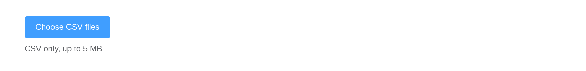
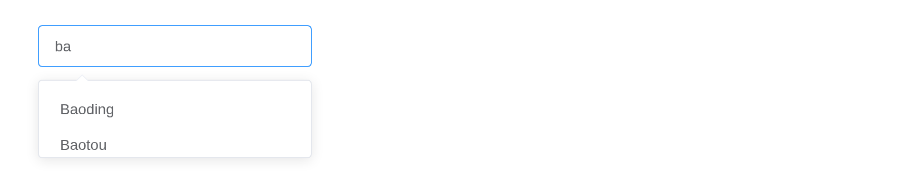
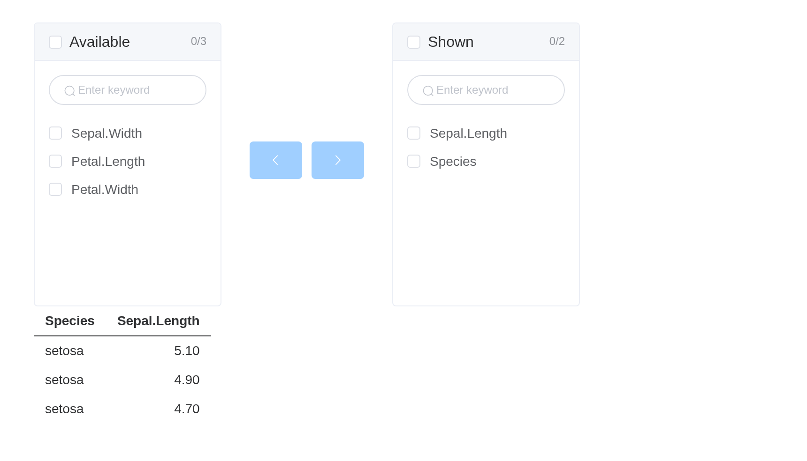

# Forms

Element’s form components each report to `input$<id>` and are set from
the server with `update_el_*()`. This covers the pieces that differ from
what you would write with Shiny’s own inputs. Every example runs as it
stands; on the website, the components under one are live, or a
screenshot of the running app where it needs a server.

## Labels

Every input takes a `label`, as Shiny’s do. It sits above the component
by default, or beside it with `label_position = "left"`, and it is the
component’s accessible name too: `<label for>` points at the native
input where there is one, `aria-labelledby` names the component where
there is not. Hiding or removing a component by its id takes its label
with it.

``` r

el_input("name", label = "Name", placeholder = "Ada Lovelace", width = "300px")
el_select("city", choices = c("Beijing", "Shanghai"), label = "City", width = "300px")
el_switch("notify", label = "Email me", label_position = "left", value = TRUE)
el_rate("stars", label = "Rating", label_position = "left", value = 4)
```

The label is drawn as Element draws an `el-form-item`, and takes the
props of one that make sense for a single input.
`label_position = "right"` aligns a label beside the component to its
right edge, and a shared `label_width` lines up a column of them;
`label_suffix` follows each label, and `required` adds Element’s red
asterisk. `error` frames the component in red with the message under it,
or beside it with `inline_message = TRUE`; `show_message = FALSE` keeps
the frame and drops the text. A component’s own `size` sizes its label
too.

``` r

el_input("user", label = "Name", label_position = "right", label_width = "90px",
         label_suffix = ":", required = TRUE, width = "260px")
el_input("email", label = "Email", label_position = "right", label_width = "90px",
         label_suffix = ":", required = TRUE, error = "That address is taken",
         width = "260px")
el_input_number("seats", label = "Seats", label_position = "right",
                 label_width = "90px", label_suffix = ":", value = 0,
                 error = "At least one", inline_message = TRUE)
el_select("team", choices = c("Data", "Design"), label = "Team",
          label_position = "right", label_width = "90px", label_suffix = ":",
          size = "small", width = "260px")
```

`error` is the message as the page first shows it. One that comes and
goes with what is typed belongs to a validator – shinyvalidate, below,
or
[`el_form()`](https://kaipingyang.github.io/shiny.element/reference/el_form.md)’s
rules.

## Choices

Anything taking `choices` accepts the shapes Shiny does – an unnamed
vector, where value and label are the same; a named one, label = value;
or a list of objects, which is how a single choice carries props of its
own.

``` r

el_select("plain", choices = c("Beijing", "Shanghai"), value = "Beijing")

el_select("named", choices = c(Beijing = "bj", Shanghai = "sh"), value = "sh")

el_select("objects", value = "sh", choices = list(
  list(value = "bj", label = "Beijing (full)", disabled = TRUE),
  list(value = "sh", label = "Shanghai")
))
```

For a checkbox or radio group, Element documents `border`, `name` and
`disabled` on the individual item rather than the group, so they go on
the choice:

``` r

el_checkbox_group("terms", selected = "a", choices = list(
  list(value = "a", label = "Agree", border = TRUE),
  list(value = "b", label = "Subscribe", border = TRUE),
  list(value = "c", label = "Unavailable", border = TRUE, disabled = TRUE)
))
```

## Validation

[`el_form()`](https://kaipingyang.github.io/shiny.element/reference/el_form.md)
renders its own fields rather than accepting standalone input
components, because Element’s validation only works inside one component
tree: a form item finds its control through Vue’s child chain and
listens for events dispatched up it. A separate Vue instance dropped in
is not in that chain.

The form reports three inputs: `input$<id>` is the model as a list,
`input$<id>_valid` whether validation passed, and `input$<id>_submit` a
counter. Here the form was submitted empty:

``` r

ui <- el_page(
  el_form(
    id = "signup", label_width = "90px",
    el_form_field("name", "input", label = "Name",
                  rules = el_rule(required = TRUE, message = "Name is required")),
    el_form_field("age", "input-number", label = "Age", value = 18),
    el_form_field("city", "select", label = "City",
                  options = c("Beijing", "Shanghai"),
                  rules = el_rule(required = TRUE, message = "Pick a city"))
  ),
  verbatimTextOutput("result")
)

server <- function(input, output, session) {
  output$result <- renderPrint({
    req(input$signup_submit)
    list(valid = input$signup_valid, model = input$signup)
  })
}

shinyApp(ui, server)
```


Validation can be driven from the server as well.
[`validate()`](https://rdrr.io/pkg/shiny/man/validate.html) returns a
promise, which resolves when the form is valid and rejects when it is
not; both arrive as `input$<id>_validate`:

``` r

ui <- el_page(
  el_form(
    id = "profile", submit_label = NULL,
    el_form_field("email", "input", label = "Email",
                  rules = el_rule(required = TRUE, message = "Email is required"))
  ),
  el_button("check", "Check from the server"),
  el_button("clear", "Clear messages"),
  verbatimTextOutput("answer")
)

server <- function(input, output, session) {
  observeEvent(input$check, el_call(session, "profile", "validate"))
  observeEvent(input$clear, el_call(session, "profile", "clearValidate"))
  output$answer <- renderPrint(input$profile_validate)
}

shinyApp(ui, server)
```


### shinyvalidate

Standalone components work with shinyvalidate as Shiny’s own inputs do.
Its message is drawn as Element draws a failed rule – the component
framed in red, the message underneath – rather than as Bootstrap’s help
text, which assumes a `.form-group` the component does not have:

``` r

library(shinyvalidate)

ui <- el_page(
  el_input("email", label = "Email", width = "300px"),
  el_select("topic", choices = c("Billing", "Support"), label = "Topic",
            width = "300px"),
  el_button("send", "Send", type = "primary")
)

server <- function(input, output, session) {
  iv <- InputValidator$new()
  iv$add_rule("email", sv_required("An email, please"))
  iv$add_rule("email", sv_email())
  iv$add_rule("topic", sv_required("Pick a topic"))
  observeEvent(input$send, iv$enable())
}

shinyApp(ui, server)
```


## Dates

A date picker reports a `Date`, as
[`dateInput()`](https://rdrr.io/pkg/shiny/man/dateInput.html) does: two
for a `"daterange"`, several for `"dates"`, `NULL` while empty.
Element’s other types – `"datetime"`, `"month"`, `"week"` – and a
`value_format` of your own report the text the picker produces, in that
format, unconverted.

``` r

ui <- el_page(
  el_date_picker("due", value = Sys.Date()),
  el_date_picker("trip", type = "daterange",
                 value = c(Sys.Date(), Sys.Date() + 7)),
  verbatimTextOutput("days")
)

server <- function(input, output, session) {
  output$days <- renderPrint(str(list(due = input$due, trip = input$trip)))
}

shinyApp(ui, server)
```


## Typing

[`el_input()`](https://kaipingyang.github.io/shiny.element/reference/el_input.md),
[`el_autocomplete()`](https://kaipingyang.github.io/shiny.element/reference/el_autocomplete.md),
[`el_input_number()`](https://kaipingyang.github.io/shiny.element/reference/el_input_number.md)
and
[`el_slider()`](https://kaipingyang.github.io/shiny.element/reference/el_slider.md)
report a quarter-second after the user stops, as
[`textInput()`](https://rdrr.io/pkg/shiny/man/textInput.html) does,
rather than on every keystroke or step. An observer on one runs once per
pause, not once per letter.

## Uploads

[`el_upload()`](https://kaipingyang.github.io/shiny.element/reference/el_upload.md)
sends files through Shiny’s own upload transport by default, so they
arrive in `input$<id>` as the data.frame
[`fileInput()`](https://rdrr.io/pkg/shiny/man/fileInput.html) gives:
`name`, `size`, `type`, `datapath`.

``` r

ui <- el_page(
  el_upload("docs", button_label = "Choose CSV files", multiple = TRUE, accept = ".csv",
            tip = "CSV only, up to 5 MB"),
  tableOutput("files")
)

server <- function(input, output, session) {
  output$files <- renderTable(input$docs[, c("name", "size")])
}

shinyApp(ui, server)
```



`drag = TRUE` gives the drop zone instead of a button:

``` r

el_upload("photos", button_label = "Drop images here, or click to choose",
          drag = TRUE, accept = "image/*")
```

Pointing `action` elsewhere switches to Element’s own transport, and the
file goes straight to that URL without reaching R. `extra_data` is
Element’s `data` prop, renamed so it is not confused with the file
itself.

``` r

el_upload("archive", button_label = "Upload to the archive",
          action = "https://example.org/upload",
          headers = list(`X-Requested-With` = "shiny.element"),
          extra_data = list(folder = "reports"))
```

## Autocomplete

Suggestions passed up front are filtered in the browser as the user
types:

``` r

el_autocomplete("city", placeholder = "Where to?", width = 260,
                suggestions = c("Beijing", "Shanghai", "Shenzhen", "Chengdu"))
```

When the list lives on the server – a database, an API – update the
suggestions from what has been typed:

``` r

cities <- c("Beijing", "Baoding", "Baotou", "Shanghai", "Shenzhen", "Chengdu")

ui <- el_page(el_autocomplete("city", placeholder = "Type a city", width = 260))

server <- function(input, output, session) {
  observeEvent(input$city, {
    typed <- tolower(input$city)
    update_el_autocomplete(session, "city",
      suggestions = cities[startsWith(tolower(cities), typed)])
  }, ignoreNULL = FALSE)
}

shinyApp(ui, server)
```



## Transfer

[`el_transfer()`](https://kaipingyang.github.io/shiny.element/reference/el_transfer.md)
takes a data.frame of `key` and `label`, and reports the keys on the
right – here driving which columns a table shows:

``` r

ui <- el_page(
  el_transfer("cols",
              data = data.frame(key = names(iris), label = names(iris)),
              value = c("Species", "Sepal.Length"),
              titles = c("Available", "Shown"),
              filterable = TRUE),
  tableOutput("preview")
)

server <- function(input, output, session) {
  output$preview <- renderTable(head(iris[, input$cols, drop = FALSE], 3))
}

shinyApp(ui, server)
```



## Sizing and layout

Every component takes `width`, which behaves like the `width` of a Shiny
input: `"200px"`, `"50%"`, or a number meaning pixels. For a form,
`label_width` and `label_position` do what Element’s do:

``` r

el_form(
  id = "compact", label_width = "80px", label_position = "left",
  submit_label = NULL,
  el_form_field("name", "input", label = "Name"),
  el_form_field("team", "select", label = "Team", options = c("Data", "Design"))
)

el_input("wide", placeholder = "width = '100%'", width = "100%")
el_input("narrow", placeholder = "width = 160", width = 160)
```
