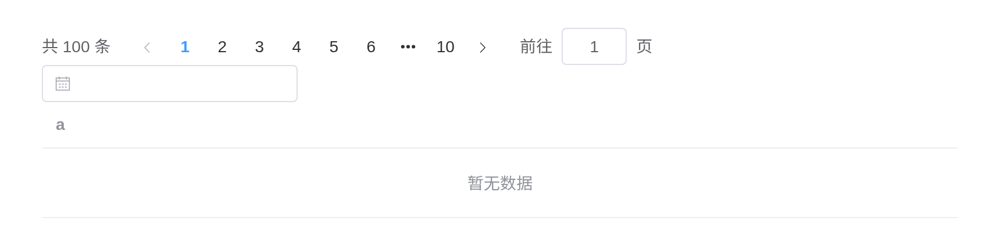
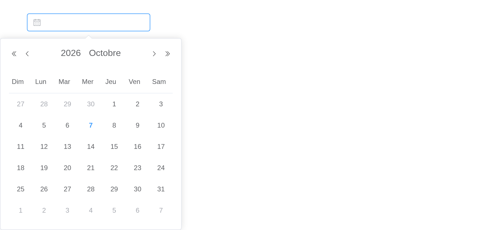

# Internationalization

Element Plus components use English by default. Their own text – a
pagination control’s total, a date picker’s month names, a table’s “No
Data” – comes from a locale, and Element Plus ships 67 of them, all
bundled with this package.

## Global configuration

`el_page(locale =)` sets the language for every component on the page,
as `app.use(ElementPlus, { locale })` does upstream:

``` r

ui <- el_page(
  locale = "zh-cn",
  el_pagination("p", total = 100, layout = "total, prev, pager, next, jumper"),
  el_date_picker("d"),
  el_table(data = data.frame(a = character(0)))
)

shinyApp(ui, function(input, output, session) {})
```



`options(shiny.element.locale =)` sets it for a session,
`use_element(locale =)` on a page that is not an
[`el_page()`](https://kaipingyang.github.io/shiny.element/reference/el_page.md).
[`el_locales()`](https://kaipingyang.github.io/shiny.element/reference/el_locales.md)
lists the codes:

``` r

shiny.element::el_locales()
```

    ##  [1] "af"    "ar"    "ar-eg" "az"    "bg"    "bn"    "ca"    "ckb"   "cs"   
    ## [10] "da"    "de"    "el"    "en"    "eo"    "es"    "et"    "eu"    "fa"   
    ## [19] "fi"    "fr"    "he"    "hi"    "hr"    "hu"    "hy-am" "id"    "it"   
    ## [28] "ja"    "kk"    "km"    "ko"    "ku"    "ky"    "lo"    "lt"    "lv"   
    ## [37] "mg"    "mn"    "ms"    "my"    "nb-no" "nl"    "no"    "pa"    "pl"   
    ## [46] "pt"    "pt-br" "ro"    "ru"    "sk"    "sl"    "sr"    "sv"    "sw"   
    ## [55] "ta"    "te"    "th"    "tk"    "tr"    "ug-cn" "uk"    "uz-uz" "vi"   
    ## [64] "zh-cn" "zh-hk" "zh-mo" "zh-tw"

Codes are matched without regard to case: `"zh-CN"` and `"zh-cn"` are
the same.

## ConfigProvider

Upstream, `el-config-provider` can set the locale for part of a page.
Here the locale is the page’s: one per page.
[`el_config_provider()`](https://kaipingyang.github.io/shiny.element/reference/el_config_provider.md)
sets the other defaults – size, button and message settings – for what
it holds; see Custom Defaults.

## Date and time localization

The date pickers’ calendars follow the locale: month and day names, and
the first day of the week. The format of a date shown in the input is
`format`, in day.js’s tokens (`"YYYY-MM-DD"`); the value Shiny gets is
`value_format`, unchanged by the language.

``` r

ui <- el_page(locale = "fr", el_date_picker("d", format = "DD MMMM YYYY"))

shinyApp(ui, function(input, output, session) {})
```



Text you pass in – labels, placeholders, messages – is yours to
translate.
