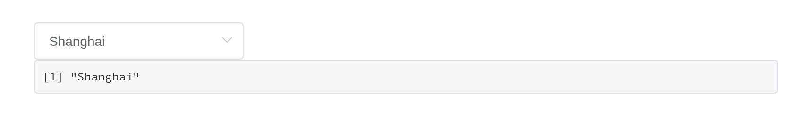
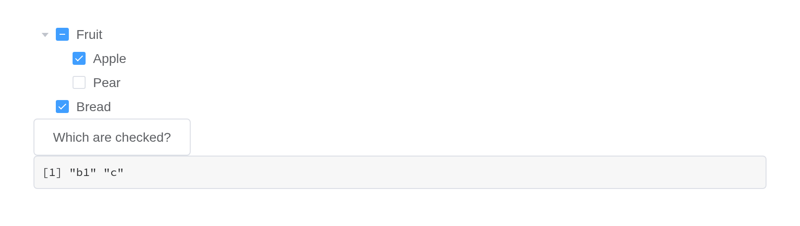
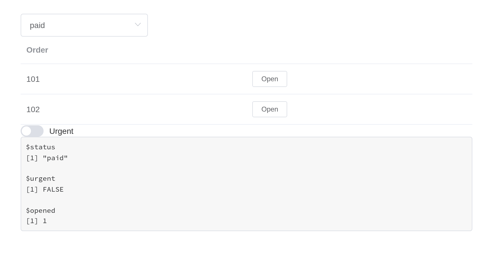
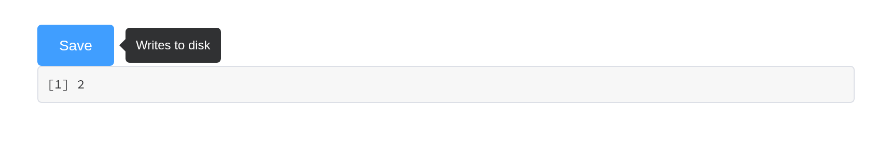
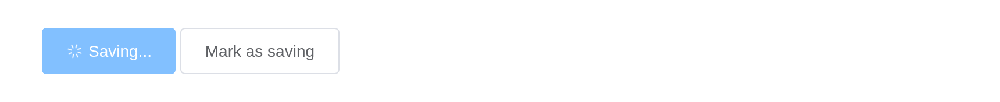

# What works, and what does not

Everything Element UI 2.15.14 documents is wrapped: 83 components, 552
attributes, 94 events, 54 methods and 42 slots. What follows is the
small print – the places where this package behaves differently from
Element in a browser, and why.

Coverage is measured rather than claimed. `tools/api-coverage.R` renders
every component and reads the markup back; `tools/api-coverage.py`
compares that with the API tables in Element’s own documentation.

## Reading and writing a component

A component reports to `input$<id>`, on load as well as on change:

``` r

ui <- el_page(
  el_select("city", choices = c("Beijing", "Shanghai"), value = "Shanghai"),
  verbatimTextOutput("picked")
)

server <- function(input, output, session) {
  output$picked <- renderPrint(input$city)
}

shinyApp(ui, server)
```



Three separate channels reach back into it, and they do different
things:

|  | Reaches | Example |
|----|----|----|
| `update_el_*()` | the component’s props | `update_el_select(session, "city", selected = "Beijing")` |
| [`el_call()`](https://kaipingyang.github.io/shiny.element/reference/el_call.md) | the component’s methods | `el_call(session, "tbl", "clearSelection")` |
| [`update_vue_data()`](https://kaipingyang.github.io/shiny.element/reference/update_vue_data.md) | the Vue instance’s fields directly | `update_vue_data(session, "tip", list(tipContent = "..."))` |

`update_el_*()` cannot call a method, because it assigns into the Vue
instance’s data and a method is a function. That is what
[`el_call()`](https://kaipingyang.github.io/shiny.element/reference/el_call.md)
is for. A method with a return value answers asynchronously, as
`input$<id>_<method>`:

``` r

ui <- el_page(
  el_tree("tree", show_checkbox = TRUE, node_key = "id",
          default_expand_all = TRUE, checked = c("b1", "c"),
          data = list(
            list(id = "a", label = "Fruit", children = list(
              list(id = "b1", label = "Apple"), list(id = "b2", label = "Pear"))),
            list(id = "c", label = "Bread")
          )),
  el_button("ask", "Which are checked?"),
  verbatimTextOutput("answer")
)

server <- function(input, output, session) {
  observeEvent(input$ask, el_call(session, "tree", "getCheckedKeys"))
  output$answer <- renderPrint(input$tree_get_checked_keys)
}

shinyApp(ui, server)
```



## Events are event inputs

Every forwarded Element event sets its input with event priority. The
input keeps its last value like any other; what event priority adds is
that sending the same value again still counts as a change. Clicking the
same row twice fires an
[`observeEvent()`](https://rdrr.io/pkg/shiny/man/observeEvent.html)
twice – while an output that only reads the value sees nothing new the
second time.

Here is the same row clicked twice. The output reading the value shows
where the last click landed; only the observer knows there were two:

``` r

ui <- el_page(
  el_table("tbl", data = head(iris[, c(1, 5)], 3)),
  verbatimTextOutput("polled"),
  verbatimTextOutput("latched")
)

server <- function(input, output, session) {
  # Reading the value: the last row clicked, but not how many times
  output$polled <- renderText({
    paste("last row clicked:", input$tbl_row_click$row_index)
  })

  # Observing the event: runs once per click, repeats included
  clicks <- reactiveVal(0)
  observeEvent(input$tbl_row_click, clicks(clicks() + 1))
  output$latched <- renderText(paste("clicks seen:", clicks()))
}

shinyApp(ui, server)
```


An event whose arguments cannot cross the wire – a native `FocusEvent`,
a DOM node, a whole Vue instance – reports `TRUE` instead, so an
observer can still tell that it happened.

## Shiny modules

Components follow Shiny’s own rule. In a module’s UI, the id is wrapped
in `ns()`, exactly as for
[`textInput()`](https://rdrr.io/pkg/shiny/man/textInput.html); in its
server, `input$<id>` and every `update_el_*()` take the bare id,
namespaced by the module’s session. That holds for UI built by
[`renderUI()`](https://rdrr.io/pkg/shiny/man/renderUI.html) inside the
module too, and for the inputs a component adds to its id –
`input$rows_go` from a row action, `input$tabs_edit`,
`input$rows_selected_rows`.

``` r

orders_ui <- function(id) {
  ns <- NS(id)
  tagList(
    el_select(ns("status"), choices = c("paid", "pending"), selected = "paid"),
    el_table(ns("rows"), data = data.frame(order = c(101, 102)), columns = list(
      list(prop = "order", label = "Order"),
      list(label = "", cell = el$button(size = "mini",
        "@click" = "rowAction('open', scope)", "Open")))),
    uiOutput(ns("more")),
    verbatimTextOutput(ns("seen"))
  )
}

orders_server <- function(id) {
  moduleServer(id, function(input, output, session) {
    # Built in the server, still wrapped in ns() once
    output$more <- renderUI(el_switch(session$ns("urgent"), active_text = "Urgent"))
    output$seen <- renderPrint(list(status = input$status, urgent = input$urgent,
                                    opened = input$rows_open$row_index))
  })
}

ui <- el_page(orders_ui("orders"))
server <- function(input, output, session) orders_server("orders")
shinyApp(ui, server)
```



Before 0.1.0 the UI functions namespaced their id themselves, from the
session they were built in – which inside
[`renderUI()`](https://rdrr.io/pkg/shiny/man/renderUI.html) in a module
turned `ns("urgent")` into `"orders-orders-urgent"`, an input that never
reported. They no longer do; their `session` argument is deprecated, and
a session passed to it still namespaces, with a warning.

## Nesting components

Two kinds of component wrap other content, and they behave differently.

**Containers are plain markup.**
[`el_row()`](https://kaipingyang.github.io/shiny.element/reference/el_row.md),
[`el_col()`](https://kaipingyang.github.io/shiny.element/reference/el_col.md),
[`el_container()`](https://kaipingyang.github.io/shiny.element/reference/el_container.md),
[`el_collapse()`](https://kaipingyang.github.io/shiny.element/reference/el_collapse.md),
[`el_tabs()`](https://kaipingyang.github.io/shiny.element/reference/el_tabs.md),
[`el_dialog()`](https://kaipingyang.github.io/shiny.element/reference/el_dialog.md)
and
[`el_drawer()`](https://kaipingyang.github.io/shiny.element/reference/el_drawer.md)
render Element’s own CSS classes and drive their state through a Shiny
input binding. They hold anything, and what is inside keeps working as
it would on its own.

``` r

el_collapse("panels", value = "one", items = list(
  list(name = "one", title = "Settings", content = tagList(
    el_switch("dark", value = TRUE, active_text = "Dark mode"),
    el_rate("stars", value = 4)
  )),
  list(name = "two", title = "About", content = tags$p("Version 0.1.0"))
))
```

Settings

About

Version 0.1.0

**Wrappers absorb what they are given.**
[`el_tooltip()`](https://kaipingyang.github.io/shiny.element/reference/el_tooltip.md),
[`el_popover()`](https://kaipingyang.github.io/shiny.element/reference/el_popover.md),
[`el_popconfirm()`](https://kaipingyang.github.io/shiny.element/reference/el_popconfirm.md)
and
[`el_infinite_scroll()`](https://kaipingyang.github.io/shiny.element/reference/el_infinite_scroll.md)
compile their content into their own Vue instance, so a component handed
to one is folded in rather than nested: the two become a single instance
carrying both sets of markup, data and methods.

``` r

ui <- el_page(
  el_tooltip("hint", el_button("save", "Save", type = "primary"),
             content = "Writes to disk", placement = "right"),
  verbatimTextOutput("clicks")
)

server <- function(input, output, session) {
  output$clicks <- renderPrint(input$save)   # still reports
}

shinyApp(ui, server)
```



This costs one thing. An absorbed component has no widget of its own, so
`HTMLWidgets.find()` cannot reach it and its `update_el_*()` stops
working. Drive it through the wrapper instead:

``` r

ui <- el_page(
  el_tooltip("hint", el_button("save", "Save", type = "primary"),
             content = "Writes to disk"),
  el_button("busy", "Mark as saving")
)

server <- function(input, output, session) {
  observeEvent(input$busy, {
    # Not update_el_button(session, "save", ...): the button has no widget
    # of its own any more. Its fields live on the tooltip.
    update_vue_data(session, "hint", list(label = "Saving...", loading = TRUE))
  })
}

shinyApp(ui, server)
```



If two absorbed components declare the same field – most declare a
`label`, a `type` and a `disabled` – the second one’s fields are renamed
on the way in (`el3_label`), and the markup that names them is rewritten
to match. You only notice when reaching in with
[`update_vue_data()`](https://kaipingyang.github.io/shiny.element/reference/update_vue_data.md),
where the renamed field is what to set.

## Slots

Every component takes `slots`, a named list:

``` r

el_alert("problem", type = "error", show_icon = TRUE,
         description = "The upload was larger than 5 MB.",
         slots = list(title = tags$span(tags$b("Upload failed"), " -- try again")))
```

**Upload failed** -- try again

A scoped slot – one where Element hands the template variables that only
exist while Vue renders – is written with
[`template()`](https://kaipingyang.github.io/shiny.element/reference/template.md)
and passed through untouched:

``` r

el_calendar("cal", value = "2026-03-15", slots = list(
  dateCell = template(
    htmltools::HTML(paste0(
      "<div>{{ data.day.slice(8) }}",
      "<b v-if=\"data.day.slice(8) === '15'\" style=\"color:#F56C6C\">",
      " due</b></div>")),
    slot = "dateCell", scope = "{date, data}"
  )
))
```

{{ data.day.slice(8) }} **due**

Filling a slot replaces what Element put there, default and all.
Element’s `el-form-item` error slot, for instance, wraps the message in
`div.el-form-item__error`; a template that renders only the message
loses the styling with it.

## Sizing

`width` is accepted by every component and behaves like the `width` of a
Shiny input – `"200px"`, `"50%"`, or a number meaning pixels. It lands
on Element’s own markup, because the host element carries
`display: contents` and generates no box of its own.

`height` is only where Element gives it a meaning:
[`el_table()`](https://kaipingyang.github.io/shiny.element/reference/el_table.md)
fixes the header and scrolls the body,
[`el_slider()`](https://kaipingyang.github.io/shiny.element/reference/el_slider.md)
sizes a vertical track,
[`el_carousel()`](https://kaipingyang.github.io/shiny.element/reference/el_carousel.md)
sets the frame. Element sizes controls through `size` (`"medium"`,
`"small"`, `"mini"`) rather than a height.

## The page around the components

Element styles its components, not the page they sit on, and most of its
components set no font of their own – they inherit the page’s.
[`el_page()`](https://kaipingyang.github.io/shiny.element/reference/el_page.md)
therefore themes the page too: its default,
[`el_theme()`](https://kaipingyang.github.io/shiny.element/reference/el_theme.md),
is a bslib theme carrying Element’s blue, greys, borders, corners, type
size and font stack, so Shiny’s own inputs and outputs match the Element
ones beside them.

``` r

el_row(gutter = 16,
  el_col(span = 12,
    textInput("shiny_text", "Shiny's textInput()", "Ada"),
    actionButton("shiny_go", "actionButton()", class = "btn-primary")),
  el_col(span = 12,
    tags$label("Element's el_input()"), el_input("el_text", value = "Ada"),
    tags$div(style = "margin-top: 15px",
      el_button("el_go", "el_button()", type = "primary"))))
```

Shiny's textInput()

actionButton()

Element's el_input()

{{label}}

`el_theme(primary = "#7c3aed")` changes the brand colour, and any other
argument of
[`bslib::bs_theme()`](https://rstudio.github.io/bslib/reference/bs_theme.html)
or Bootstrap variable can be overridden the same way. Element’s own
components keep Element’s colours whatever the theme says: they are
compiled into its stylesheet, and changing them means building a custom
Element theme.

## Element’s own markup

`el` holds a generator for every Element tag, for markup that needs no
Vue instance of its own – inside one that already exists. Vue compiles
`<el-*>` tags only within the component it mounts, so a raw tag goes
where a component draws its contents: a
[`template()`](https://kaipingyang.github.io/shiny.element/reference/template.md),
a slot, a table `cell`, a wrapper’s trigger.

``` r

# The tooltip's instance compiles the raw button it wraps
el_tooltip("hint", el$button(type = "primary", "Markup only"), content = "No input")
el_button("save", "A component", type = "primary")   # reports input$save
```

Markup only

{{label}}

Placed at the top level of a page, the same `el$button()` is never
compiled and shows as its bare text. Use the raw tag where a component
would be wasted, and a component where the server needs to hear about
it.

## Building your own

[`el_widget()`](https://kaipingyang.github.io/shiny.element/reference/el_widget.md)
assembles a component the way this package assembles its own, and is
exported for wrapping anything not covered here, or covered differently:

``` r

initials <- function(id, name, size = 48) {
  el_widget(
    id     = id,
    markup = el$avatar(":size" = "size", "{{ letters }}"),
    data   = list(size = size, letters = paste(substr(strsplit(name, " ")[[1]], 1, 1),
                                               collapse = "")),
    dependency = element_ui_dependency()
  )
}

initials("ada", "Ada Lovelace")
initials("alan", "Alan Mathison Turing", size = 64)
```

{{ letters }}

{{ letters }}

Calling [`vueR::vue()`](https://rdrr.io/pkg/vueR/man/vue.html) yourself
works too. What
[`el_widget()`](https://kaipingyang.github.io/shiny.element/reference/el_widget.md)
carries, and what is then yours to remember, is `display: contents` on
the host, a zero-sized widget element, and the `el` selector – each of
which is there because of a bug.

## Where the argument name differs from Element’s

Arguments are snake_case versions of Element’s prop names, with six
exceptions. Each is deliberate; the rest translate mechanically
(`show-overflow-tooltip` becomes `show_overflow_tooltip`).

| Element | Here | Why |
|----|----|----|
| `default-active` | `active` | It is the current item, and [`update_el_menu()`](https://kaipingyang.github.io/shiny.element/reference/update_el_menu.md) changes it – “default” would suggest it is only read once |
| `default-expanded-keys` | `expanded` | As above, for [`el_tree()`](https://kaipingyang.github.io/shiny.element/reference/el_tree.md) |
| `default-checked-keys` | `checked` | As above |
| `props` | `label_field`, `children_field`, `disabled_field`, `is_leaf_field` | [`el_tree()`](https://kaipingyang.github.io/shiny.element/reference/el_tree.md)’s field map is four arguments rather than a nested list |
| `data` (upload) | `extra_data` | [`el_upload()`](https://kaipingyang.github.io/shiny.element/reference/el_upload.md)’s `data` would read as the file, not the fields sent beside it |
| `width` (popover) | `popover_width` | Every component takes `width` for its own size; this one sizes the card |

### Two names for the choice components

[`el_select()`](https://kaipingyang.github.io/shiny.element/reference/el_select.md),
[`el_radio_group()`](https://kaipingyang.github.io/shiny.element/reference/el_radio_group.md)
and
[`el_checkbox_group()`](https://kaipingyang.github.io/shiny.element/reference/el_checkbox_group.md)
sit beside
[`selectInput()`](https://rdrr.io/pkg/shiny/man/selectInput.html),
[`radioButtons()`](https://rdrr.io/pkg/shiny/man/radioButtons.html) and
[`checkboxGroupInput()`](https://rdrr.io/pkg/shiny/man/checkboxGroupInput.html),
so they take Shiny’s names – and Element’s as well:

| Shiny’s name | Element’s name | Meaning            |
|--------------|----------------|--------------------|
| `choices`    | `options`      | what can be picked |
| `selected`   | `value`        | what is picked     |

Either works, in the components and in their `update_el_*()`, so code
reads naturally to someone coming from either side:

``` r

el_select("city_shiny", choices = c(Beijing = "bj", Shanghai = "sh"), selected = "sh")
el_select("city_element", options = c(Beijing = "bj", Shanghai = "sh"), value = "sh")
```

The same holds in the server:
`update_el_select(session, "city", selected = "bj")` and
`update_el_select(session, "city", value = "bj")` do one thing.

Given both names in one call, the two must agree; two different values
are an error rather than one quietly winning. The help pages document
each pair as one argument (`selected, value`). No other component has a
second name: everywhere else Shiny and Element already agree on `value`.

A component’s `value` prop is its `v-model`, so it is the `value`
argument where the component has one and the binding elsewhere –
[`el_tooltip()`](https://kaipingyang.github.io/shiny.element/reference/el_tooltip.md)
and
[`el_popover()`](https://kaipingyang.github.io/shiny.element/reference/el_popover.md)
use `value` for whether they are open, which `update_el_*(value =)`
sets.

[`el_upload()`](https://kaipingyang.github.io/shiny.element/reference/el_upload.md)’s
`on-success`, `on-error` and `http-request` are taken: they are how
files reach Shiny. The other hooks (`on-change`, `on-progress`,
`before-upload`, …) are yours.

Where a name does differ, the component’s help page documents both.

## Without Shiny

The components also work on a page with no Shiny session – an R Markdown
or Quarto document, a page saved with
[`htmltools::save_html()`](https://rstudio.github.io/htmltools/reference/save_html.html).
They render and respond: a select opens and picks, tabs switch, a
collapse folds, a table’s rows tick. What they cannot do there is
report: there is no `input`, and `update_el_*()`,
[`el_call()`](https://kaipingyang.github.io/shiny.element/reference/el_call.md)
and the feedback functions have no server to come from. Load the scripts
once with
[`use_element()`](https://kaipingyang.github.io/shiny.element/reference/use_element.md),
as for any page that is not an
[`el_page()`](https://kaipingyang.github.io/shiny.element/reference/el_page.md).
The examples on this website are built exactly so.

## Known gaps

**Three attributes are deliberately unbound.** `value` on `el-checkbox`
and `el-radio`, which a group owns through `v-model`, and the deprecated
`auto-complete` spellings on `el-select` and `el-input`, which upstream
marks `@DEPRECATED` beside the `autocomplete` this package binds. They
are listed in `tools/api-coverage.py` with the reason.

**Element’s i18n covers the component text, not yours.**
`el_page(locale =)` switches Element’s own strings – a date picker’s
month names, a table’s “No Data”. Text you pass in is yours to
translate.

**A component inside a
[`renderUI()`](https://rdrr.io/pkg/shiny/man/renderUI.html) is
re-created, not updated.** That is Shiny’s behaviour rather than this
package’s, but it matters more here: the new instance starts from its
arguments, so anything the user had changed is lost. Prefer
`update_el_*()` where you can.
