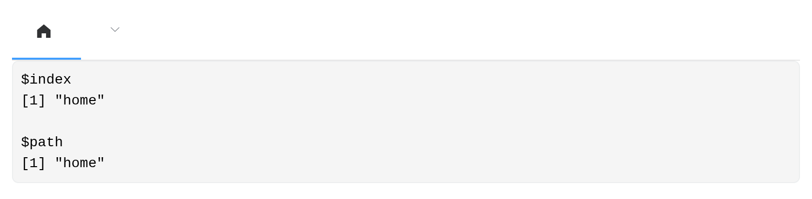
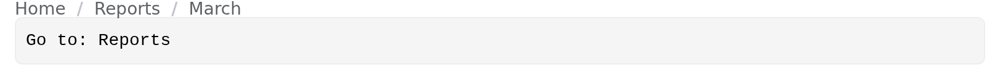
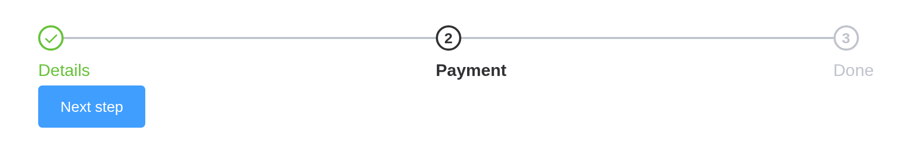
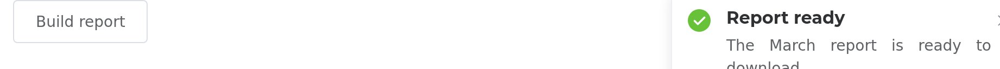
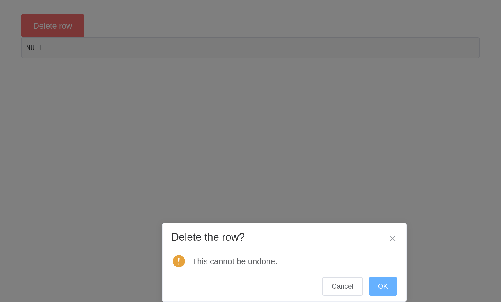
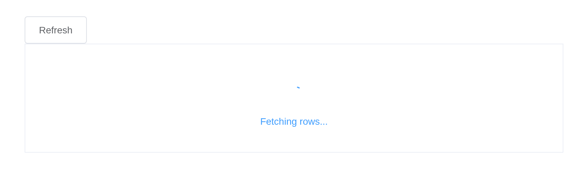

# Navigation and feedback

Element’s navigation components report where the user went; its feedback
components are called from the server. Neither navigates or blocks on
its own – what happens next is your app’s decision.

## Menus

[`el_menu()`](https://kaipingyang.github.io/shiny.element/reference/el_menu.md)
takes a nested list. Each item’s `index` is what it reports, and
`input$<id>_path` gives the trail to it:

``` r

ui <- el_page(
  el_menu("nav", mode = "horizontal", active = "reports", items = list(
    list(index = "home", label = "Home", icon = "el-icon-s-home"),
    list(index = "reports", label = "Reports", children = list(
      list(index = "monthly", label = "Monthly"),
      list(index = "annual", label = "Annual")
    )),
    list(index = "settings", label = "Settings", disabled = TRUE)
  )),
  verbatimTextOutput("where")
)

server <- function(input, output, session) {
  output$where <- renderPrint(list(index = input$nav, path = input$nav_path))
}

shinyApp(ui, server)
```



`active` is Element’s `default-active`: it is the current item, and
[`update_el_menu()`](https://kaipingyang.github.io/shiny.element/reference/update_el_menu.md)
moves it, so “default” would undersell it.

## Breadcrumbs

A breadcrumb reports the label clicked, so it can drive navigation
inside a Shiny app without any routing:

``` r

ui <- el_page(
  el_breadcrumb("trail", items = list(
    list(label = "Home"), list(label = "Reports"), list(label = "March")
  )),
  verbatimTextOutput("went")
)

server <- function(input, output, session) {
  output$went <- renderText(paste("Go to:", input$trail))
}

shinyApp(ui, server)
```



## Steps

[`el_steps()`](https://kaipingyang.github.io/shiny.element/reference/el_steps.md)
reports the active step and is moved from the server:

``` r

ui <- el_page(
  el_steps("wizard", active = 0, finish_status = "success", steps = list(
    list(title = "Details"), list(title = "Payment"), list(title = "Done")
  )),
  el_button("next", "Next step", type = "primary")
)

server <- function(input, output, session) {
  observeEvent(input$`next`, {
    update_el_steps(session, "wizard", active = min(input$wizard + 1, 3))
  })
}

shinyApp(ui, server)
```



## Tabs

[`el_tabs()`](https://kaipingyang.github.io/shiny.element/reference/el_tabs.md)
holds live components, because it renders as markup rather than as a Vue
instance of its own:

``` r

el_tabs("views", type = "border-card", tabs = list(
  list(name = "settings", label = "Settings", content = tagList(
    el_switch("dark", value = TRUE, active_text = "Dark mode"),
    el_slider("size", value = 14, min = 10, max = 24)
  )),
  list(name = "about", label = "About", content = tags$p("Version 0.1.0"))
))
```

Settings

About

Version 0.1.0

## Messages and notifications

These are calls from the server rather than UI. Neither waits for an
answer:

``` r

ui <- el_page(el_button("save", "Save", type = "primary"))

server <- function(input, output, session) {
  observeEvent(input$save, {
    el_message(session, "Saved", type = "success")
  })
}

shinyApp(ui, server)
```


``` r

ui <- el_page(el_button("run", "Build report"))

server <- function(input, output, session) {
  observeEvent(input$run, {
    el_notification(session, "The March report is ready to download.",
                    title = "Report ready", type = "success")
  })
}

shinyApp(ui, server)
```



A message given an `id` can be closed from the server by it – one that
stays up while work runs, say, with `duration = 0`:

``` r

ui <- el_page(el_button("upload", "Upload", type = "primary"))

server <- function(input, output, session) {
  observeEvent(input$upload, {
    el_message(session, "Uploading...", id = "busy", duration = 0,
               icon_class = "el-icon-loading")
    later::later(function() {
      el_message_close(session, "busy")
      el_message(session, "Uploaded", type = "success")
    }, 5)
  })
}

shinyApp(ui, server)
```


## Asking a question

When you need an answer,
[`el_message_box()`](https://kaipingyang.github.io/shiny.element/reference/el_message_box.md)
asks and reports it as `input$<id>`: `"confirm"`, `"cancel"` or
`"close"`. For `box_type = "prompt"`, a confirmed answer is a list of
`action` and the `value` typed.

``` r

ui <- el_page(
  el_button("delete", "Delete row", type = "danger"),
  verbatimTextOutput("answer")
)

server <- function(input, output, session) {
  observeEvent(input$delete, {
    el_message_box(session, "confirm_delete", "This cannot be undone.",
                   title = "Delete the row?", type = "warning")
  })
  output$answer <- renderPrint(input$confirm_delete)
}

shinyApp(ui, server)
```



For something smaller than a dialog,
[`el_popconfirm()`](https://kaipingyang.github.io/shiny.element/reference/el_popconfirm.md)
anchors the question to the button that raised it, and reports
`input$<id>_confirm`:

``` r

el_popconfirm("remove",
  reference = el_button("remove_btn", "Remove", type = "danger"),
  title = "Remove this item?")
```

{{label}}

## Loading

[`el_loading()`](https://kaipingyang.github.io/shiny.element/reference/el_loading.md)
opens a named mask and
[`el_loading_close()`](https://kaipingyang.github.io/shiny.element/reference/el_loading_close.md)
shuts it. The message goes out as soon as it is sent, so a mask opened
before slow work is on screen while the work runs:

``` r

ui <- el_page(
  el_button("refresh", "Refresh"),
  tags$div(id = "panel", style = "height: 160px; border: 1px solid #ebeef5",
           tableOutput("rows"))
)

server <- function(input, output, session) {
  observeEvent(input$refresh, {
    el_loading(session, "busy", target = "#panel", text = "Fetching rows...")
    on.exit(el_loading_close(session, "busy"), add = TRUE)
    Sys.sleep(3)   # the slow part
    output$rows <- renderTable(head(mtcars, 3))
  })
}

shinyApp(ui, server)
```



Because the mask is named, a second call under the same name replaces
the first rather than stacking.

## Dialogs and drawers

Both are markup with a Shiny input binding, so they hold live
components. `input$<id>` is whether it is open – closing by the cross or
the backdrop is visible to the server too.

``` r

ui <- el_page(
  el_button("open", "Settings", type = "primary"),
  el_dialog("settings", title = "Settings", width = "420px",
    content = tagList(
      el_switch("dark", value = TRUE, active_text = "Dark mode"),
      tags$br(), tags$br(),
      el_slider("size", value = 14, min = 10, max = 24)
    ),
    footer = el_button("apply", "Apply", type = "primary"))
)

server <- function(input, output, session) {
  observeEvent(input$open, update_el_dialog(session, "settings", visible = TRUE))
  observeEvent(input$apply, update_el_dialog(session, "settings", visible = FALSE))
}

shinyApp(ui, server)
```


