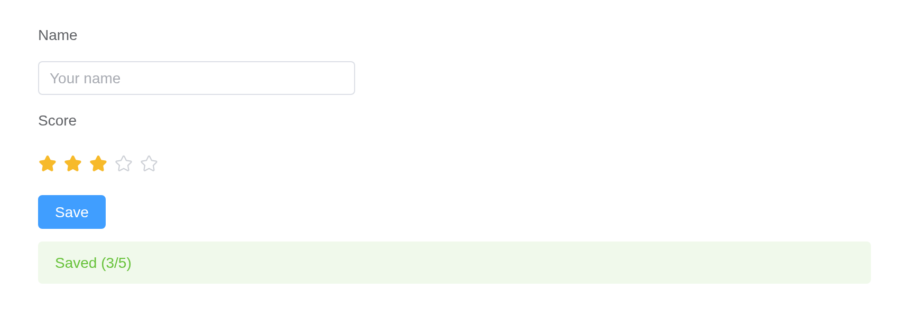

# Get started

shiny.element brings Element Plus 2.14.7 – its inputs, tables, trees,
menus, dialogs and the rest – to Shiny. Each component reports through
`input$<id>` and is updated from the server, like any other Shiny input.
Element Plus, its icons and Vue 3.5 ship inside the package, so an app
needs no network.

## Installation

``` r

install.packages("shiny.element")
# or the development version
remotes::install_github("kaipingyang/shiny.element")
```

## Quick start

[`el_page()`](https://kaipingyang.github.io/shiny.element/reference/el_page.md)
is the page: it loads Vue and Element Plus and gives the page Element
Plus’s look.

``` r

library(shiny)
library(shiny.element)

ui <- el_page(
  el_input("name", label = "Name", placeholder = "Your name", width = "300px"),
  el_rate("score", label = "Score", value = 3),
  el_button("save", "Save", type = "primary"),
  tags$div(style = "height: 12px"),
  el_alert("hint", title = "Nothing saved yet", type = "info", closable = FALSE)
)

server <- function(input, output, session) {
  observeEvent(input$save, {
    update_el_alert(id = "hint", type = "success",
                    title = paste0("Saved ", input$name, " (", input$score, "/5)"))
  })
}

shinyApp(ui, server)
```



Inside another page function –
[`fluidPage()`](https://rdrr.io/pkg/shiny/man/fluidPage.html), bslib’s
[`page_sidebar()`](https://rstudio.github.io/bslib/reference/page_sidebar.html)
– call
[`use_element()`](https://kaipingyang.github.io/shiny.element/reference/use_element.md)
once instead, giving it the page’s theme so Element follows it:

``` r

theme <- el_theme(primary = "#7c3aed")
ui <- bslib::page_sidebar(
  theme = theme,
  use_element(theme = theme),
  sidebar = bslib::sidebar(el_select("metric", choices = c("Mean", "Median"))),
  el_table("summary", data = head(iris))
)
```

## Reading and writing

A component with a value reports it as `input$<id>`, on load and on
change. The server changes it with the matching `update_el_*()`, runs
one of Element’s methods with
[`el_call()`](https://kaipingyang.github.io/shiny.element/reference/el_call.md),
and shows a message, a notification or a question with
[`el_message()`](https://kaipingyang.github.io/shiny.element/reference/el_message.md),
[`el_notification()`](https://kaipingyang.github.io/shiny.element/reference/el_notification.md)
and
[`el_message_box()`](https://kaipingyang.github.io/shiny.element/reference/el_message_box.md).
Element’s events arrive as `input$<id>_<event>`.

``` r

server <- function(input, output, session) {
  output$chosen <- renderText(input$city)                     # read
  observeEvent(input$reset, update_el_select(id = "city", selected = "Beijing"))
  observeEvent(input$clear, el_call(id = "orders", method = "clearSelection"))
  observeEvent(input$orders_row_click, el_message(message = "Row clicked"))
}
```

## Where next

- **Components** – a page for each of Element’s components, in Element’s
  own order, each demo of its documentation in R and its API tables
  beside the R names.
- **Forms and validation** – labels and errors, choices,
  [`el_form()`](https://kaipingyang.github.io/shiny.element/reference/el_form.md),
  shinyvalidate, dates.
- **Shiny integration** – events, methods, modules, bookmarking,
  shinyjs, data from the server, components of your own.
- **Theming**, **Internationalization**, **Dark Mode**, **Custom
  Defaults**, **Built-in Transitions** – as in Element Plus’s own guide,
  from R.
- **Migration from Element UI** – what changed from shiny.element’s Vue
  2 release.
- **What works, and what does not** – where this differs from Element in
  a browser.
