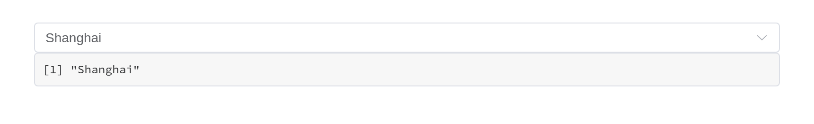
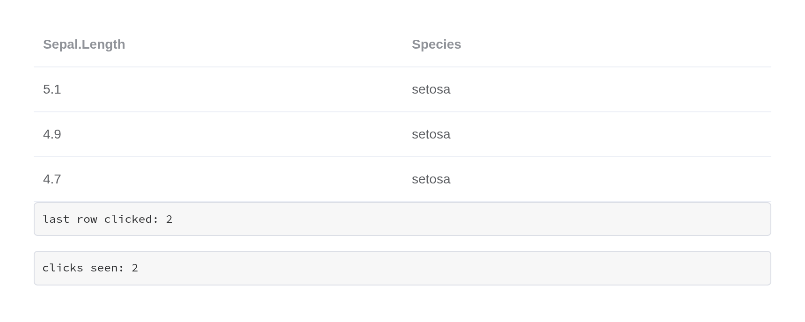
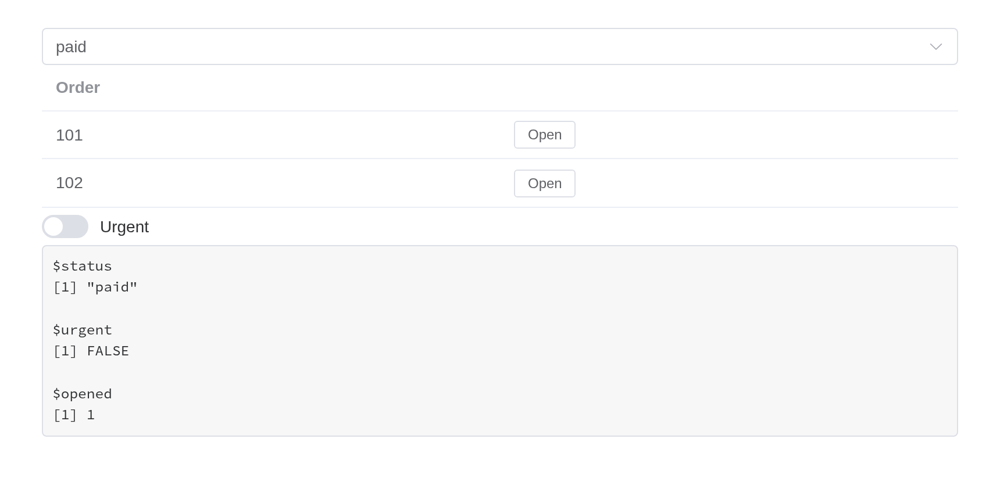
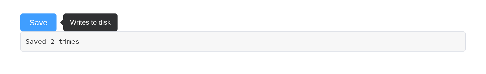
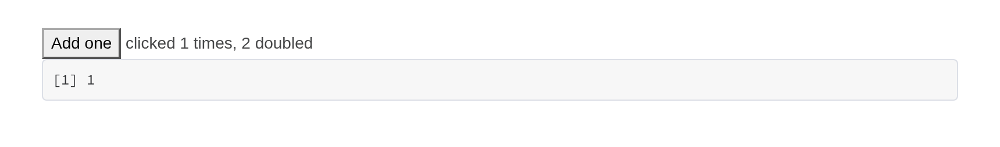
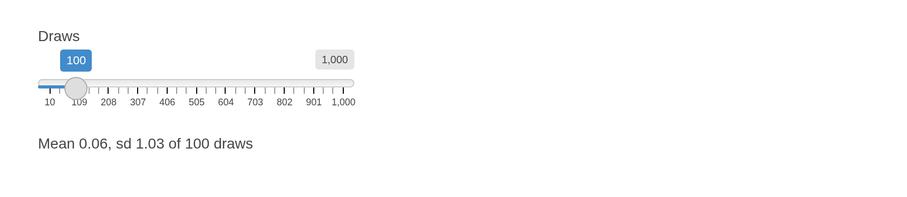
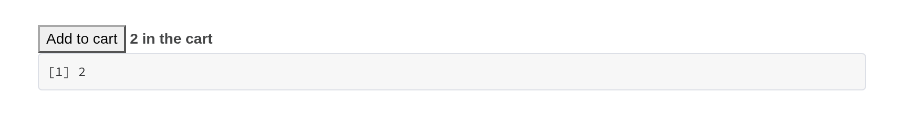
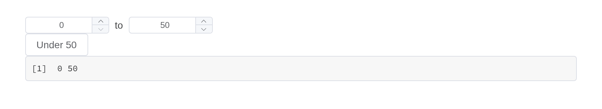

# Shiny integration

How the components meet Shiny: what they report, how the server reaches
them, how they behave in modules, with bookmarks and alongside the rest
of the Shiny ecosystem, and how to build components of your own. Each
component’s own page – under Components – shows what Element does with
it.

## Reading and writing a component

A component reports to `input$<id>`, on load as well as on change:

``` r

ui <- el_page(
  el_select("city", choices = c("Beijing", "Shanghai"), value = "Shanghai"),
  verbatimTextOutput("picked")
)

server <- function(input, output, session) {
  output$picked <- renderPrint(input$city)
}

shinyApp(ui, server)
```



Three separate channels reach back into it, and they do different
things:

|  | Reaches | Example |
|----|----|----|
| `update_el_*()` | the component’s props | `update_el_select(session, "city", selected = "Beijing")` |
| [`call_el()`](https://kaipingyang.github.io/shiny.element/reference/call_el.md) | the component’s methods | `call_el(session, "tbl", "clearSelection")` |
| [`update_vue()`](https://kaipingyang.github.io/shiny.element/reference/update_vue.md) | the Vue instance’s fields directly | `update_vue(session, "tip", tipContent = "...")` |

Like Shiny’s `update*Input()`, each takes the current session by
default, so `update_el_select(id = "city", selected = "Beijing")` is the
same call. An update reaches a component whether or not it has a value
to report – an alert, a timeline, a component only ever drawn by
[`renderUI()`](https://rdrr.io/pkg/shiny/man/renderUI.html) – and one
sent to an id that is not on the page, or to a field the component does
not have, logs a `[shiny-vue]` warning in the browser console rather
than vanishing.

`update_el_*()` cannot call a method, because it assigns into the Vue
instance’s data and a method is a function. That is what
[`call_el()`](https://kaipingyang.github.io/shiny.element/reference/call_el.md)
is for. A method with a return value answers asynchronously, as
`input$<id>_<method>`:

``` r

ui <- el_page(
  el_tree(
    "tree",
    show_checkbox = TRUE,
    node_key = "id",
    default_expand_all = TRUE,
    checked = c("b1", "c"),
    data = list(
      list(
        id = "a",
        label = "Fruit",
        children = list(
          list(id = "b1", label = "Apple"),
          list(id = "b2", label = "Pear")
        )
      ),
      list(id = "c", label = "Bread")
    )
  ),
  el_button("ask", "Which are checked?"),
  verbatimTextOutput("answer")
)

server <- function(input, output, session) {
  observeEvent(input$ask, call_el(session, "tree", "getCheckedKeys"))
  output$answer <- renderPrint(input$tree_get_checked_keys)
}

shinyApp(ui, server)
```


## Events are event inputs

Every forwarded Element event sets its input with event priority. The
input keeps its last value like any other; what event priority adds is
that sending the same value again still counts as a change. Clicking the
same row twice fires an
[`observeEvent()`](https://rdrr.io/pkg/shiny/man/observeEvent.html)
twice – while an output that only reads the value sees nothing new the
second time.

Here is the same row clicked twice. The output reading the value shows
where the last click landed; only the observer knows there were two:

``` r

ui <- el_page(
  el_table_output("tbl"),
  verbatimTextOutput("polled"),
  verbatimTextOutput("latched")
)

server <- function(input, output, session) {
  output$tbl <- render_el_table(
    el_table(data = head(iris[, c(1, 5)], 3)) |> el_on("row-click")
  )

  # Reading the value: the last row clicked, but not how many times
  output$polled <- renderText({
    paste("last row clicked:", input$tbl_row_click$row_index)
  })

  # Observing the event: runs once per click, repeats included
  clicks <- reactiveVal(0)
  observeEvent(input$tbl_row_click, clicks(clicks() + 1))
  output$latched <- renderText(paste("clicks seen:", clicks()))
}

shinyApp(ui, server)
```



An event whose arguments cannot cross the wire – a native `FocusEvent`,
a DOM node, a whole Vue instance – reports `TRUE` instead, so an
observer can still tell that it happened.

## Shiny modules

Components follow Shiny’s own rule. In a module’s UI, the id is wrapped
in `ns()`, exactly as for
[`textInput()`](https://rdrr.io/pkg/shiny/man/textInput.html); in its
server, `input$<id>` and every `update_el_*()` take the bare id,
namespaced by the module’s session. That holds for UI built by
[`renderUI()`](https://rdrr.io/pkg/shiny/man/renderUI.html) inside the
module too, and for the inputs a component adds to its id –
`input$rows_go` from a row action, `input$tabs_edit`,
`input$rows_selection_change`. An output is the same:
`el_table_output(ns("rows"))` in the UI, `output$rows` in the server.

``` r

orders_ui <- function(id) {
  ns <- NS(id)
  tagList(
    el_select(ns("status"), choices = c("paid", "pending"), selected = "paid"),
    el_table_output(ns("rows")),
    uiOutput(ns("more")),
    verbatimTextOutput(ns("seen"))
  )
}

orders_server <- function(id) {
  moduleServer(id, function(input, output, session) {
    output$rows <- render_el_table(el_table(
      data = data.frame(order = c(101, 102)),
      columns = list(
        list(prop = "order", label = "Order"),
        list(
          label = "",
          cell = el$button(
            size = "small",
            "@click" = "rowAction('open', scope)",
            "Open"
          )
        )
      )
    ))
    # Built in the server, still wrapped in ns() once
    output$more <- renderUI(el_switch(
      session$ns("urgent"),
      active_text = "Urgent"
    ))
    output$seen <- renderPrint(list(
      status = input$status,
      urgent = input$urgent,
      opened = input$rows_open$row_index
    ))
  })
}

ui <- el_page(orders_ui("orders"))
server <- function(input, output, session) orders_server("orders")
shinyApp(ui, server)
```



Before 0.1.0 the UI functions namespaced their id themselves, from the
session they were built in – which inside
[`renderUI()`](https://rdrr.io/pkg/shiny/man/renderUI.html) in a module
turned `ns("urgent")` into `"orders-orders-urgent"`, an input that never
reported. They no longer do; their `session` argument is deprecated, and
a session passed to it still namespaces, with a warning.

## Shiny’s own tools

Each component is a Shiny input binding on a host element that carries
its id, so the tools that work on Shiny’s inputs work on these.

**Bookmarking.** Under
[`enableBookmarking()`](https://rdrr.io/pkg/shiny/man/enableBookmarking.html),
every component’s value comes back from a bookmark – including where a
container is: the open tab, the open panels of a collapse, an open
dialog or drawer, the menu’s current item, the pager’s page. Nothing
needs to be set up beyond what Shiny itself asks for.

``` r

ui <- function(request) {
  el_page(
    el_select("city", choices = c("Beijing", "Shanghai")),
    el_tabs(
      "views",
      tabs = list(
        list(name = "table", label = "Table", content = tags$p("...")),
        list(name = "chart", label = "Chart", content = tags$p("..."))
      )
    ),
    bookmarkButton()
  )
}
server <- function(input, output, session) {}
shinyApp(ui, server, enableBookmarking = "url")
```

**shinyjs.**
[`shinyjs::hide()`](https://rdrr.io/pkg/shinyjs/man/visibilityFuncs.html)
and [`show()`](https://rdrr.io/r/methods/show.html) take the component
and its label with it; `disable()` and `enable()` set the component’s
own `disabled`, so it is drawn disabled as Element draws it rather than
having a native attribute set somewhere underneath. `reset()` puts the
components under the element it is given back as the page first had
them, beside Shiny’s own inputs; to set any other value, use the
component’s `update_el_*()`. `hidden()` and `disabled()` wrap a
component in the UI, `click()` clicks the button or link inside it, and
`onclick()` and `onevent()` hear events from inside it. `addClass()`
puts a class on the component’s host, which draws no box of its own
(`display: contents`): style the component with its own `class` argument
instead.

**bslib.** Components work in bslib’s containers – a sidebar, a card, an
accordion, a nav panel not yet shown – and bslib’s
[`tooltip()`](https://rstudio.github.io/bslib/reference/tooltip.html)
and
[`popover()`](https://rstudio.github.io/bslib/reference/popover.html)
take one as their trigger. bslib’s
[`input_dark_mode()`](https://rstudio.github.io/bslib/reference/input_dark_mode.html)
turns Element Plus’s dark mode with Bootstrap’s. Element’s brand colours
follow Bootstrap’s CSS variables, so a theme changed while the app runs
– `session$setCurrentTheme()`,
[`bslib::bs_themer()`](https://rstudio.github.io/bslib/reference/run_with_themer.html)
– recolours Element’s components too.

**Busy indicators.** Under
[`useBusyIndicators()`](https://rdrr.io/pkg/shiny/man/useBusyIndicators.html)
a table output keeps Element’s own loading mask while it recalculates,
in place of Shiny’s spinner; `el_table_output(loading = FALSE)` gives it
Shiny’s.

**Asynchronous work.** Every render function waits for a promise, so the
result of an `ExtendedTask` or a `promises` pipeline can be rendered as
a table or as a component’s data.

**Inserting and removing.**
[`insertUI()`](https://rdrr.io/pkg/shiny/man/insertUI.html) and
[`renderUI()`](https://rdrr.io/pkg/shiny/man/renderUI.html) mount what
they add; [`removeUI()`](https://rdrr.io/pkg/shiny/man/insertUI.html) on
a component’s id removes it and destroys its Vue instance, so it stops
reporting.

**Validation.** shinyvalidate draws its message the way Element draws a
failed rule; see the forms article.

**Testing.** shinytest2’s `set_inputs()` and `get_values()` read and
write a component as they do a
[`textInput()`](https://rdrr.io/pkg/shiny/man/textInput.html). An input
with no component of its own behind it – a table’s `_selection_rows`, an
event such as `_row_click` – has no input binding, so `set_inputs()`
needs `allow_no_input_binding_ = TRUE` for it, and sets the server’s
value only: the page does not tick the rows.

## Nesting components

Two kinds of component wrap other content, and they behave differently.

**Containers are plain markup.**
[`el_row()`](https://kaipingyang.github.io/shiny.element/reference/el_row.md),
[`el_col()`](https://kaipingyang.github.io/shiny.element/reference/el_col.md),
[`el_container()`](https://kaipingyang.github.io/shiny.element/reference/el_container.md),
[`el_collapse()`](https://kaipingyang.github.io/shiny.element/reference/el_collapse.md),
[`el_tabs()`](https://kaipingyang.github.io/shiny.element/reference/el_tabs.md),
[`el_dialog()`](https://kaipingyang.github.io/shiny.element/reference/el_dialog.md)
and
[`el_drawer()`](https://kaipingyang.github.io/shiny.element/reference/el_drawer.md)
render Element’s own CSS classes and drive their state through a Shiny
input binding. They hold anything, and what is inside keeps working as
it would on its own.

``` r

el_collapse(
  "panels",
  value = "one",
  items = list(
    list(
      name = "one",
      title = "Settings",
      content = tagList(
        el_switch("dark", value = TRUE, active_text = "Dark mode"),
        el_rate("stars", value = 4)
      )
    ),
    list(name = "two", title = "About", content = tags$p("Version 0.1.0"))
  )
)
```

Settings

About

Version 0.1.0

**Wrappers absorb what they are given.**
[`el_tooltip()`](https://kaipingyang.github.io/shiny.element/reference/el_tooltip.md),
[`el_popover()`](https://kaipingyang.github.io/shiny.element/reference/el_popover.md),
[`el_popconfirm()`](https://kaipingyang.github.io/shiny.element/reference/el_popconfirm.md)
and
[`el_infinite_scroll()`](https://kaipingyang.github.io/shiny.element/reference/el_infinite_scroll.md)
compile their content into their own Vue instance, so a component handed
to one is folded in rather than nested: the two become a single instance
carrying both sets of markup, data and methods.

``` r

ui <- el_page(
  el_tooltip("hint", el_button("save", "Save", type = "primary"),
             content = "Writes to disk", placement = "right"),
  verbatimTextOutput("clicks")
)

server <- function(input, output, session) {
  output$clicks <- renderText(paste("Saved", input$save, "times"))   # still reports
}

shinyApp(ui, server)
```



An absorbed component has no host of its own, but it keeps its id: the
wrapper lists the components it took in, and `update_el_*()` and
[`call_el()`](https://kaipingyang.github.io/shiny.element/reference/call_el.md)
for that id reach it through the wrapper’s instance. In the page the id
is on the component itself, as Element hands it on – a button’s
`<button>`, an input’s `<input>` – rather than on a host around it.

``` r

ui <- el_page(
  el_tooltip(
    "hint",
    el_button("save", "Save", type = "primary"),
    content = "Writes to disk"
  ),
  el_button("busy", "Mark as saving")
)

server <- function(input, output, session) {
  observeEvent(input$busy, {
    update_el_button(session, "save", label = "Saving...", loading = TRUE)
  })
}

shinyApp(ui, server)
```


If two absorbed components declare the same field – most declare a
`label`, a `type` and a `disabled` – the second one’s fields are renamed
on the way in (`el3_label`), and the markup that names them is rewritten
to match. Updates by the component’s id follow the renaming;
[`update_vue()`](https://kaipingyang.github.io/shiny.element/reference/update_vue.md)
on the wrapper’s id sets the fields under the names they have there.

## Slots

Every component takes `slots`, a named list:

``` r

el_alert(
  "problem",
  type = "error",
  show_icon = TRUE,
  description = "The upload was larger than 5 MB.",
  slots = list(title = tags$span(tags$b("Upload failed"), " -- try again"))
)
```

A scoped slot – one where Element hands the template variables that only
exist while Vue renders – is written with
[`template()`](https://kaipingyang.github.io/shiny.element/reference/template.md)
and passed through untouched:

``` r

el_calendar(
  "cal",
  value = "2026-03-15",
  slots = list(
    dateCell = template(
      htmltools::HTML(paste0(
        "<div>{{ data.day.slice(8) }}",
        "<b v-if=\"data.day.slice(8) === '15'\" style=\"color:#F56C6C\">",
        " due</b></div>"
      )),
      slot = "dateCell",
      scope = "{date, data}"
    )
  )
)
```

Filling a slot replaces what Element put there, default and all.
Element’s `el-form-item` error slot, for instance, wraps the message in
`div.el-form-item__error`; a template that renders only the message
loses the styling with it.

## Element’s own markup

`el` holds a generator for every Element tag, for markup that needs no
Vue instance of its own – inside one that already exists. Vue compiles
`<el-*>` tags only within the component it mounts, so a raw tag goes
where a component draws its contents: a
[`template()`](https://kaipingyang.github.io/shiny.element/reference/template.md),
a slot, a table `cell`, a wrapper’s trigger.

``` r

# The tooltip's instance compiles the raw button it wraps
el_tooltip(
  "hint",
  el$button(type = "primary", "Markup only"),
  content = "No input"
)
el_button("save", "A component", type = "primary") # reports input$save
```

Placed at the top level of a page, the same `el$button()` is never
compiled and shows as its bare text. Use the raw tag where a component
would be wasted, and a component where the server needs to hear about
it.

## Building your own

Every component in this package is a Vue component on a host element
that carries its id, with a Shiny input binding on it – the way reactR
binds React components – so the rest of Shiny reaches it:
[`shinyjs::hide()`](https://rdrr.io/pkg/shinyjs/man/visibilityFuncs.html),
[`removeUI()`](https://rdrr.io/pkg/shiny/man/insertUI.html), a test
driver’s `set_inputs()`, bookmarks. The layer that does this is
exported, and knows nothing of Element:
[`vue_app()`](https://kaipingyang.github.io/shiny.element/reference/vue_app.md)
writes a Vue component in R.

### Vue’s options, under Vue’s names

The arguments of
[`vue_app()`](https://kaipingyang.github.io/shiny.element/reference/vue_app.md)
are the options of a Vue 3 component – `template`, `data`, `methods`,
`computed`, `watch`, `emits`, `setup`, `components`, the lifecycle hooks
– under Vue’s own names (a multi-word one also as snake_case:
`before_unmount`). Three things are added, as Shiny needs them: `id`,
where the component goes and what the server calls it; `input`, the
field that is `input$<id>`; and `dependencies`. `use` is Vue’s
`app.use()`.

``` r

ui <- fluidPage(
  vue_app(
    "counter",
    template = tags$div(
      tags$button(`@click` = "n++", "Add one"),
      tags$span(" clicked {{ n }} times, {{ doubled }} doubled")
    ),
    data = list(n = 0),
    computed = list(doubled = JS("function() { return this.n * 2; }")),
    input = "n"
  ),
  verbatimTextOutput("n")
)

server <- function(input, output, session) {
  output$n <- renderPrint(input$counter)
}

shinyApp(ui, server)
```



| Vue | In R |
|----|----|
| `createApp(options).mount('#app')` | `vue_app(id, ...)` |
| [`data()`](https://rdrr.io/r/utils/data.html), `methods`, `computed`, `watch`, hooks | the same names; functions written with [`JS()`](https://kaipingyang.github.io/shiny.element/reference/JS.md) |
| `setup()` (the Composition API) | `setup = JS("function() { ... }")` |
| `app.use(Plugin, options)` | `use = list(Plugin = options)` |
| the component’s value | `input = "<field>"`, reported as `input$<id>` |
| `this.$emit("picked", x)` | `input$<id>_picked`, for an event listed in `emits` |
| a child component | `components = list(todo_item = vue_component(...))` |

A component’s value is one field, or several (`input = c("from", "to")`)
for one value that is a named list – `input$<id>$from`, `input$<id>$to`,
never an input per field – as
[`dateRangeInput()`](https://rdrr.io/pkg/shiny/man/dateRangeInput.html)
gives one value of two dates. Anything else it sends out goes Vue’s way,
with `$emit()`, and arrives with event priority under the component’s
id, as Element’s own events do: `$emit("picked", x)` is
`input$<id>_picked` holding `x`; several arguments are a list, `arg1`,
`arg2`, …; none is `TRUE`. Inside a module, wrap the id in `ns()`; the
events follow it.

`data` is the initial state as R writes it: a list is an object, a
data.frame its rows – a data.frame further in, or a list column, too. A
vector of one element is a single value, as everywhere in Shiny:
`c("a", "b")` is an array, `"a"` a string. Where JavaScript expects an
array whatever its length – a list of tags, `v-for` over it – wrap it in
[`I()`](https://rdrr.io/r/base/AsIs.html): `list(tags = I("red"))` is
`{"tags": ["red"]}`. Show a user’s data through it – `{{ field }}`,
`:prop="field"` – which Vue renders as text. Never paste it into the
template: a template is code, and `{{ }}` in it runs.

### Templates: tags or a string

The template takes htmltools tags or a string, and Vue reads both the
same:

- **tags** when the markup is built in R –
  [`lapply()`](https://rdrr.io/r/base/lapply.html) over columns, `if`
  around a block, other tags spliced in. Directive names need quoting
  (`` `@click` ``, `` `:title` ``, `` `#header` ``); expressions with
  `<`, `>` or `&` are fine, Vue decodes what htmltools escapes.
- **a string** for a template copied from Vue’s or a library’s
  documentation, or one dense with quotes and expressions: it stays
  exactly as written.

### The server’s way in

| Function | Does | Shiny’s own |
|----|----|----|
| `update_vue(session, id, field = value, value =)` | sets fields of the component’s state; `value` is its input field | `update*Input()` |
| `call_vue(session, id, method, args)` | runs a method; its result comes back as `input$<id>_<method>` | – |
| `vue_answer(session, id, request, value)` | answers a component that asked the server (`shinyVue.ask()`) | – |
| `vue_output(id)` / `render_vue(expr)` | draws components from the server, keeping the user’s state | [`uiOutput()`](https://rdrr.io/pkg/shiny/man/htmlOutput.html) / [`renderUI()`](https://rdrr.io/pkg/shiny/man/renderUI.html) |
| `vue_app(outputs =)` / `render_vue_data(expr)` | sets data fields by name from an output: values, not markup | shinyreact’s `reactive_output()` |

[`render_vue()`](https://kaipingyang.github.io/shiny.element/reference/vue_output.md)
differs from [`renderUI()`](https://rdrr.io/pkg/shiny/man/renderUI.html)
in one way: a render that changes only a component’s data updates that
component instead of replacing it, so what the user did – a sort, a
tick, an open tab – stays. A render that changes the structure replaces
it, as [`renderUI()`](https://rdrr.io/pkg/shiny/man/renderUI.html)
would. Put what changes from render to render in `data`, and keep the
template the same.

### Data from outputs

Two outputs, by who writes the component.
[`render_vue()`](https://kaipingyang.github.io/shiny.element/reference/vue_output.md)
draws one the server writes – template, options, methods and data, any
of which a render can change – as shiny.react’s `renderReact()` draws
React. Where the component is written in the UI and only its data comes
from the server, the component names an output in `outputs` and its data
follows it:
[`render_vue_data()`](https://kaipingyang.github.io/shiny.element/reference/render_vue_data.md)
renders data fields by name – `list(mean = 1, sd = 2)`, each value a
number, a list, a data.frame’s rows, a \[JS()\] function – and the
fields it names take those values, as
[`update_vue()`](https://kaipingyang.github.io/shiny.element/reference/update_vue.md)
would set them. As there, a field must be declared in `data`: Vue tracks
only the fields a component starts with. It is an output as Shiny knows
them: it runs again when what it reads changes, waits while its
component is hidden, waits for a promise, and while it runs
`$recalculating.<id>` is `true`, for the template to say so.

``` r

ui <- fluidPage(
  sliderInput("n", "Draws", 10, 1000, 100),
  vue_app(
    "summary",
    tags$p(
      `:style` = "{opacity: $recalculating.stats ? 0.4 : 1}",
      "Mean {{ mean }}, sd {{ sd }} of {{ n }} draws"
    ),
    data = list(mean = NA, sd = NA, n = 0),
    outputs = "stats"
  )
)

server <- function(input, output, session) {
  output$stats <- render_vue_data({
    x <- rnorm(input$n)
    list(mean = round(mean(x), 2), sd = round(sd(x), 2), n = input$n)
  })
}

shinyApp(ui, server)
```



Inside a module the id is wrapped, as any output’s is:
`outputs = ns("stats")`. A component can follow several outputs, each
setting its own fields: `outputs = c("stats", "trend")`.

One output can feed several components, or a
[`vue_store()`](https://kaipingyang.github.io/shiny.element/reference/vue_store.md)
that every component reads – the shared state Vue’s guide recommends,
with the server as its source:

``` r

ui <- fluidPage(
  vue_store("sales", data = list(revenue = 0, growth = 0), outputs = "totals"),
  vue_app("kpi", tags$b("{{ $store.sales.revenue }}")),
  vue_app("trend", tags$i("{{ $store.sales.growth }} %"))
)

server <- function(input, output, session) {
  output$totals <- render_vue_data({
    s <- summarise_sales(input$region)
    list(revenue = s$revenue, growth = s$growth)
  })
}
```

[`render_vue()`](https://kaipingyang.github.io/shiny.element/reference/vue_output.md),
[`render_vue_data()`](https://kaipingyang.github.io/shiny.element/reference/render_vue_data.md)
and
[`render_el_table()`](https://kaipingyang.github.io/shiny.element/reference/el_table_output.md)
can be cached with
[`bindCache()`](https://rdrr.io/pkg/shiny/man/bindCache.html), as
Shiny’s own render functions can. A table output caches the table as
rendered, the same for every session; read back from the cache, it is
still compared with what each page has, so the page gets only what
changed.

### State shared between components

Each component is a Vue application of its own, so Vue’s `provide`
cannot reach from one to another.
[`vue_store()`](https://kaipingyang.github.io/shiny.element/reference/vue_store.md)
is what Vue’s guide recommends instead, one shared
[`reactive()`](https://rdrr.io/pkg/shiny/man/reactive.html) object, read
and written by every template as `$store.<id>.<field>` – at once, in the
browser. Give it `input` and the server sees it too, and
[`update_vue()`](https://kaipingyang.github.io/shiny.element/reference/update_vue.md)
sets it:

``` r

ui <- fluidPage(
  vue_store("cart", data = list(count = 0), input = "count"),
  vue_app("add", tags$button(`@click` = "$store.cart.count++", "Add to cart")),
  vue_app("badge", tags$b(" {{ $store.cart.count }} in the cart")),
  verbatimTextOutput("server_sees")
)

server <- function(input, output, session) {
  output$server_sees <- renderPrint(input$cart)
}

shinyApp(ui, server)
```



A change in the browser shows everywhere at once; one that goes through
the server waits for the round trip.

### An Element component of your own

[`el_widget()`](https://kaipingyang.github.io/shiny.element/reference/el_widget.md)
is
[`vue_app()`](https://kaipingyang.github.io/shiny.element/reference/vue_app.md)
with Element Plus installed and a label in Element’s form-item style –
what every component in this package is made of. A price range made of
two number inputs, reported as one value:

``` r

price_range_input <- function(id, value = c(0, 100), min = 0, max = 1000) {
  el_widget(
    id = id,
    markup = tags$div(
      style = "display: flex; align-items: center; gap: 8px",
      el$input_number(
        "v-model" = "range[0]",
        ":min" = "min",
        ":max" = "range[1]",
        "controls-position" = "right",
        size = "small"
      ),
      tags$span("to"),
      el$input_number(
        "v-model" = "range[1]",
        ":min" = "range[0]",
        ":max" = "max",
        "controls-position" = "right",
        size = "small"
      )
    ),
    data = list(range = as.list(value), min = min, max = max),
    input = "range",
    dependency = element_plus_dependency()
  )
}

ui <- el_page(
  price_range_input("price", value = c(20, 300)),
  el_button("cheap", "Under 50"),
  verbatimTextOutput("picked")
)

server <- function(input, output, session) {
  observeEvent(input$cheap, update_vue(session, "price", value = list(0, 50)))
  output$picked <- renderPrint(input$price)
}

shinyApp(ui, server)
```



## Without Shiny

The components also work on a page with no Shiny session – an R Markdown
or Quarto document, a page saved with
[`htmltools::save_html()`](https://rstudio.github.io/htmltools/reference/save_html.html).
They render and respond: a select opens and picks, tabs switch, a
collapse folds, a table’s rows tick. What they cannot do there is
report: there is no `input`, and `update_el_*()`,
[`call_el()`](https://kaipingyang.github.io/shiny.element/reference/call_el.md)
and the feedback functions have no server to come from. Load the scripts
once with
[`use_element()`](https://kaipingyang.github.io/shiny.element/reference/use_element.md),
as for any page that is not an
[`el_page()`](https://kaipingyang.github.io/shiny.element/reference/el_page.md).
The examples on this website are built exactly so.

## Data from the server

Where Element takes a JavaScript function to fetch data, the server can
answer instead, through an input and an update:

| Component | Asks through | Answered by |
|----|----|----|
| `el_select(remote = TRUE)` | `input$<id>_query` | `update_el_select(choices =)` |
| `el_autocomplete(remote = TRUE)` | `input$<id>_query` | `update_el_autocomplete(suggestions =)` |
| `el_tree(lazy = TRUE)` | `input$<id>_load` | [`el_load_children()`](https://kaipingyang.github.io/shiny.element/reference/el_load_children.md) |
| `el_cascader(props = list(lazy = TRUE))` | `input$<id>_lazy_load` | [`el_load_children()`](https://kaipingyang.github.io/shiny.element/reference/el_load_children.md) |
| `el_table(lazy = TRUE)` | `input$<id>_load` | [`el_load_children()`](https://kaipingyang.github.io/shiny.element/reference/el_load_children.md) |
| [`el_infinite_scroll()`](https://kaipingyang.github.io/shiny.element/reference/el_infinite_scroll.md) | `input$<id>_load` | a [`uiOutput()`](https://rdrr.io/pkg/shiny/man/htmlOutput.html) inside it |
| [`el_pagination()`](https://kaipingyang.github.io/shiny.element/reference/el_pagination.md) | `input$<id>`, the page | `update_el_table(data =)` |

A question the server never answers settles after 30 seconds – a lazy
load with nothing, a remote search by leaving its loading state – and a
lazy load’s question settles at once when its component is removed or
the session ends. The Select, Input, Tree, Cascader and Table pages show
each one running.
