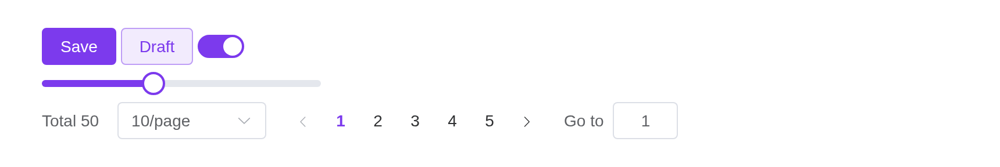

# Theming

Element Plus is themed through CSS variables – `--el-color-primary` and
some hundreds more – which its theming guide overrides on the page. Here
[`el_theme()`](https://kaipingyang.github.io/shiny.element/reference/el_theme.md)
does it, alongside the Bootstrap theme of the page around the
components. Languages, dark mode, sizes for the whole page and the
built-in transitions have guides of their own.

## Sizing

`width` is accepted by every component and behaves like the `width` of a
Shiny input – `"200px"`, `"50%"`, or a number meaning pixels. It lands
on Element’s own markup, because the host element carries
`display: contents` and generates no box of its own.

`height` is only where Element Plus gives it a meaning:
[`el_table()`](https://kaipingyang.github.io/shiny.element/reference/el_table.md)
fixes the header and scrolls the body,
[`el_slider()`](https://kaipingyang.github.io/shiny.element/reference/el_slider.md)
sizes a vertical track,
[`el_carousel()`](https://kaipingyang.github.io/shiny.element/reference/el_carousel.md)
sets the frame. Element Plus sizes controls through `size` (`"large"`,
`"default"`, `"small"`) rather than a height.

`el_page(size = "small")` sets that size for every component not given
one of its own, as `app.use(ElementPlus, { size: "small" })` does
upstream; `z_index` sets where Element’s popups start stacking.
[`use_element()`](https://kaipingyang.github.io/shiny.element/reference/use_element.md)
takes both too. Element Plus’s responsive helper classes –
`hidden-xs-only`, `hidden-md-and-up` and the rest of its `display.css` –
are loaded with it, for any tag:
`tags$div(class = "hidden-sm-and-down", ...)`.

## The page around the components

Element styles its components, not the page they sit on, and most of its
components set no font of their own – they inherit the page’s.
[`el_page()`](https://kaipingyang.github.io/shiny.element/reference/el_page.md)
therefore themes the page too: its default,
[`el_theme()`](https://kaipingyang.github.io/shiny.element/reference/el_theme.md),
is a bslib theme carrying Element’s blue, greys, borders, corners, type
size and font stack, so Shiny’s own inputs and outputs match the Element
ones beside them.

``` r

el_row(gutter = 16,
  el_col(span = 12,
    textInput("shiny_text", "Shiny's textInput()", "Ada"),
    actionButton("shiny_go", "actionButton()", class = "btn-primary")),
  el_col(span = 12,
    tags$label("Element's el_input()"), el_input("el_text", value = "Ada"),
    tags$div(style = "margin-top: 15px",
      el_button("el_go", "el_button()", type = "primary"))))
```

Shiny's textInput()

actionButton()

Element's el_input()

`el_theme(primary = "#7c3aed")` changes the brand colour, and any other
argument of
[`bslib::bs_theme()`](https://rstudio.github.io/bslib/reference/bs_theme.html)
or Bootstrap variable can be overridden the same way. The theme’s
`primary`, `success`, `warning`, `danger` and `info` reach Element’s
components too, with the tints and shades Element derives from each – a
plain button’s pale fill, a focused input’s border:

``` r

ui <- el_page(theme = el_theme(primary = "#7c3aed"),
  el_button("save", "Save", type = "primary"),
  el_button("draft", "Draft", type = "primary", plain = TRUE),
  el_switch("notify", value = TRUE),
  el_slider("level", value = 40, width = "240px"),
  el_pagination("pages", total = 50))

shinyApp(ui, function(input, output, session) {})
```



Element Plus’s other variables – its radii, sizes, greys, the full list
in its `theme-chalk` stylesheet – go in `el_theme(element =)`, by name
without the `--el-`:

``` r

theme <- el_theme(primary = "#0f766e", element = list(
  "border-radius-base" = "12px", "border-radius-small" = "8px",
  "font-size-base" = "13px", "component-size" = "36px"))

ui <- el_page(theme = theme,
  el_input("name", placeholder = "Rounder, smaller", width = "260px"),
  el_button("go", "Go", type = "primary"),
  el_tag("t", "Tag"))

shinyApp(ui, function(input, output, session) {})
```


They are set on the page as CSS variables, as Element Plus’s theming
guide sets them: nothing is compiled, and a theme costs nothing to
switch. A brand colour brings its tints – `--el-color-primary-light-3`
to `-light-9`, `-dark-2` – for the light page and for dark mode.
`use_element(theme =)` does the same on a page that is not an
[`el_page()`](https://kaipingyang.github.io/shiny.element/reference/el_page.md).

## Further

- Internationalization: `el_page(locale =)`.
- Dark mode: Element Plus’s `html.dark`.
- Custom defaults: `el_page(size =, z_index =)` and
  [`el_config_provider()`](https://kaipingyang.github.io/shiny.element/reference/el_config_provider.md).
- Built-in transitions: `el-fade-in`, `el-zoom-in-top`,
  `el$collapse_transition()`.
