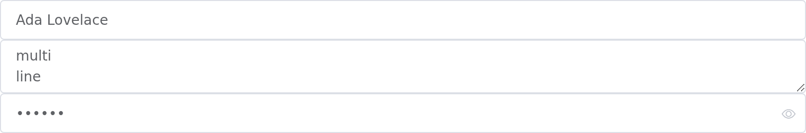
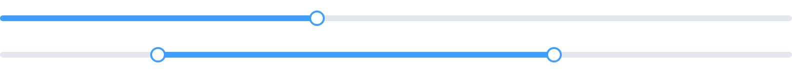
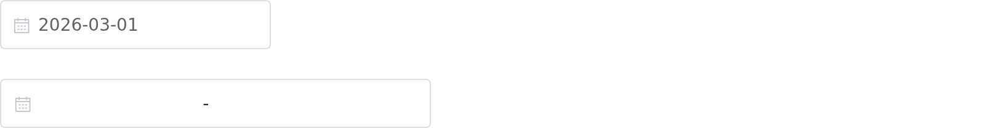
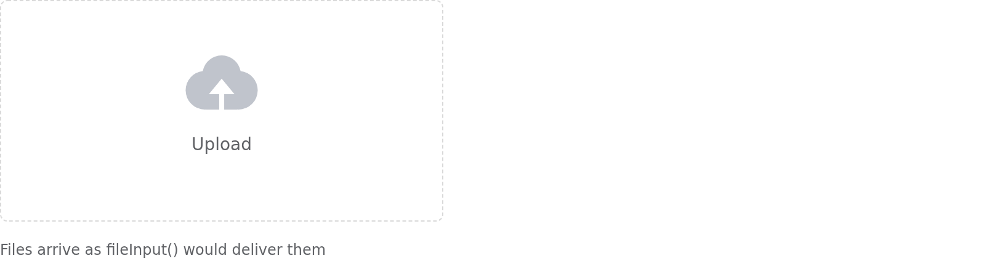
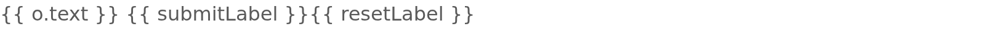
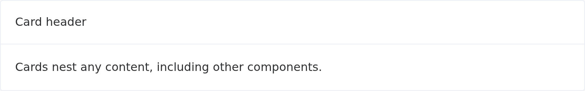
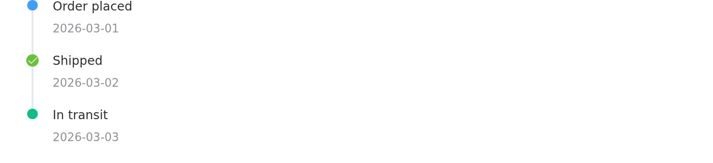
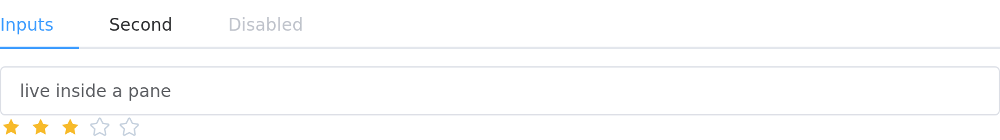
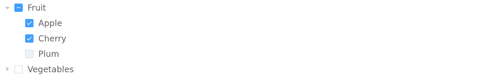

Every screenshot below is the real component, captured from a running Shiny app
in headless Chromium. Regenerate them with `Rscript tools/screenshots.R` after
changing how something looks.

Each component reports to the server as `input$<id>`, on load as well as on
change, and is updated from the server with the matching `update_el_*()`.

## Inputs

### `el_input()`

Text, textarea and password, with the usual Element trimmings.

```r
el_input("name", value = "Ada Lovelace", placeholder = "your name")
el_input("notes", type = "textarea", rows = 2)
el_input("pw", type = "password", show_password = TRUE)
```



### `el_input_number()`

```r
el_input_number("age", value = 18, min = 0, max = 150)
```


### `el_select()`

Single or multiple. `choices` takes a named vector or a list of
`list(value=, label=)`.

```r
el_select("city", choices = c(Beijing = "bj", Shanghai = "sh"))
el_select("tags", choices = c(A = "a", B = "b", C = "c"), multiple = TRUE)
```


### `el_radio_group()`

```r
el_radio_group("plan", choices = c(Basic = "x", Pro = "y"))
el_radio_group("range", choices = c(Day = "d", Week = "w"), button = TRUE)
```


### `el_checkbox_group()`

```r
el_checkbox_group("langs", choices = c(R = "r", Python = "p", SQL = "s"),
                  selected = c("r", "s"))
```


### `el_switch()`

```r
el_switch("live", value = TRUE, active_text = "on", inactive_text = "off")
```


### `el_slider()`

```r
el_slider("score", value = 40)
el_slider("band", value = c(20, 70), range = TRUE)
```



### `el_rate()`

```r
el_rate("stars", value = 3, show_text = TRUE)
```


### `el_date_picker()`

```r
el_date_picker("when", value = "2026-03-01")
el_date_picker("span", type = "daterange")
```



### `el_color_picker()`

```r
el_color_picker("shade", value = "#409EFF")
```


### `el_cascader()`

Nested options; `df_to_cascader_options()` builds them from a data frame.

```r
el_cascader("region", options = list(
  list(value = "zj", label = "Zhejiang", children = list(
    list(value = "hz", label = "Hangzhou")))))
```


### `el_upload()`

Element's upload over Shiny's own transport, so `input$files` is the data frame
`fileInput()` produces, `datapath` and all. Pass `action` instead to post
straight to a URL.

```r
el_upload("files", drag = TRUE, multiple = TRUE, tip = "CSV only", accept = ".csv")
```



## Forms

### `el_form()`

The form owns its model, so validation runs in the browser and the whole form
reports once on submit rather than field by field. `input$signup` carries the
model, `input$signup_valid` the verdict, `input$signup_submit` a counter.

```r
el_form(
  id = "signup", label_width = "110px",
  el_form_field("name", "input", label = "Name",
                rules = el_rule(required = TRUE, message = "Name is required")),
  el_form_field("email", "input", label = "Email",
                rules = el_rule(type = "email", message = "Not a valid email")),
  el_form_field("city", "select", label = "City",
                choices = c(Beijing = "bj", Shanghai = "sh"))
)
```



## Display

### `el_button()`

```r
el_button("save", "Primary", type = "primary")
el_button("go", "Round", type = "primary", round = TRUE)
el_button("wait", "Loading", type = "primary", loading = TRUE)
```


### `el_tag()`

```r
el_tag("t", label = "closable", type = "warning", closable = TRUE)
```


### `el_alert()`

```r
el_alert("hint", title = "info", type = "info", show_icon = TRUE,
         description = "with a description")
```


### `el_progress()`

Line, circle and dashboard.

```r
el_progress("pct", percentage = 70)
el_progress("ring", percentage = 70, type = "circle")
```


### `el_badge()`

```r
el_badge(el_button("msg", "messages"), value = 12)
el_badge(el_button("hi", "capped"), value = 200, max = 99)
```


### `el_card()`

```r
el_card(header = "Card header", "Cards nest any content.")
```



### `el_table()`

Takes a data frame directly and infers its columns. With `selection = TRUE`,
`input$tbl_selected_rows` gives 1-based row numbers with their R types intact.

```r
el_table(id = "tbl", data = head(iris, 4), selection = TRUE)
```


### `el_pagination()`

```r
el_pagination("pager", total = 200, page_size = 20, current_page = 3)
```


### `el_timeline()`

Entries can be replaced wholesale with `update_el_timeline()`, which suits a
log that grows.

```r
el_timeline("log", items = list(
  list(content = "Order placed", timestamp = "2026-03-01", type = "primary"),
  list(content = "Shipped", timestamp = "2026-03-02", type = "success",
       icon = "el-icon-check", size = "large")))
```



### `el_carousel()`

```r
el_carousel("banner", height = "160px", items = list(
  list(name = "one", content = tags$h3("First")),
  list(name = "two", content = tags$h3("Second"))))
```


### `el_divider()` and `el_link()`

```r
el_divider()
el_link("primary", type = "primary")
```


### Icons

Element's icon font ships with the package; any `el-icon-*` class works.

```r
tags$i(class = "el-icon-edit")
el_icon("star-on")
```


## Containers

These render as plain markup rather than Vue instances, which is what lets them
hold other components from this package. A component placed inside one stays
connected to the server.

### `el_tabs()`

```r
el_tabs("section", tabs = list(
  list(name = "x", label = "Inputs",
       content = tagList(el_input("q"), el_rate("stars"))),
  list(name = "y", label = "Second", content = "Panes hold components.")))
```



### `el_collapse()`

```r
el_collapse("panels", value = "p1", items = list(
  list(name = "p1", title = "Filters",
       content = tagList(el_input("q"), el_switch("live")))))
```


### `el_steps()`

```r
el_steps("wizard", active = 1, finish_status = "success", steps = list(
  list(title = "Pick", description = "choose a plan"),
  list(title = "Pay",  description = "enter card"),
  list(title = "Done", description = "all set")))
```


### `el_dialog()` and `el_drawer()`

Open and close them from the server; `input$<id>` is `TRUE` while open.

```r
el_dialog("confirm", title = "Confirm", content = el_input("reason"))
update_el_dialog(session, "confirm", visible = TRUE)

el_drawer("settings", title = "Settings", direction = "rtl", size = "320px")
```

### `el_row()` / `el_col()`

A 24-column grid.

```r
el_row(gutter = 20,
  el_col(span = 12, "span = 12"),
  el_col(span = 12, "span = 12"))
```


### `el_container()`

```r
el_container(
  el_header("Header"),
  el_container(el_aside(width = "160px", "Aside"), el_main("Main")))
```


## Navigation

### `el_menu()`

Nests to any depth. `input$nav` gives the selected index, `input$nav_path` the
full path down to it.

```r
el_menu("nav", active = "home", items = list(
  list(index = "home", label = "Home", icon = "el-icon-house"),
  list(index = "data", label = "Data", children = list(
    list(index = "all", label = "All records")))))
```


### `el_tree()`

`df_to_tree_data()` builds the node list from a data frame.

```r
el_tree("picker", show_checkbox = TRUE, checked = "apple", data = list(
  list(id = "fruit", label = "Fruit", children = list(
    list(id = "apple", label = "Apple")))))
```



### `el_dropdown()`

```r
el_dropdown("actions", trigger_label = "Actions", items = list(
  list(command = "edit", label = "Edit"),
  list(command = "del",  label = "Delete")))
```


## Feedback

`el_notification()` and `el_message()` are called from the server and render
themselves; there is nothing to place in the UI.

```r
el_notification(session, message = "Saved", title = "Done", type = "success")
el_message(session, message = "Check the form", type = "warning")
```
